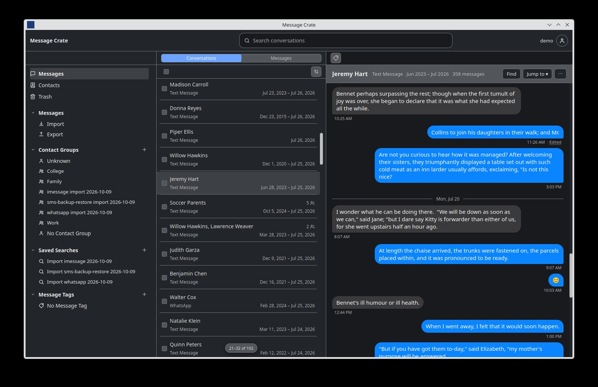

[![pull-request][pull-request-shield]][pull-request-url]
[![Issues][issues-shield]][issues-url]
[![project_license][license-shield]][license-url]
[![source_available][source-available-shield]][license-url]
[![open-source][open-source-shield]][license-url]
[![ai-honesty][ai-honesty-shield]][ai-honesty-url]

 

  

<h1 align="center">Message Crate</h1>
  

    Your messages, out of the apps.
     
     
    <a href="https://messagecrate.app/docs/user/"><strong>Explore the docs »</strong></a>
     
    <a href="https://messagecrate.app/docs/user/try/what-is-message-crate/">Try Message Crate</a>
    &middot;
    <a href="https://github.com/messagecrate/message-crate/issues/new?labels=bug&template=bug_report.md">Report Bug</a>
    &middot;
    <a href="https://github.com/messagecrate/message-crate/issues/new?labels=enhancement&template=feature_request.md">Request Feature</a>
  

<!-- TABLE OF CONTENTS -->

  
Table of Contents

  <ol>
    <li><a href="#about-the-project">About The Project</a></li>
    <li><a href="#who-the-project-is-for">Who The Project Is For</a></li>
    <li><a href="#getting-started">Getting Started</a></li>
    <li><a href="#faq">FAQ</a></li>
    <li><a href="#contributing">Contributing</a></li>
    <li><a href="#additional-documentation">Additional documentation</a></li>
    <li><a href="#license">License</a></li>
    <li><a href="#how-message-crate-is-built">How Message Crate Is Built</a></li>
    <li><a href="#project-status">Project Status</a></li>
    <li><a href="#maintainers">Maintainers</a></li>
    <li><a href="#related-projects">Related Projects</a></li>
  </ol>

## About The Project

[![Docker][Docker]][Docker-url] [![React][React.js]][React-url] [![Rust][Rust-dev]][Rust-url] [![SQLite][SQLite]][SQLite-url] [![Tauri][Tauri]][Tauri-url] [![Vite][Vite]][Vite-url]

Message Crate copies conversations and their attachments out of chat apps and phone backups (iMessage, WhatsApp, Android SMS) into a local archive.
Conversations open in a browser or the desktop app, years of messages are searchable, and everything exports back out as ordinary files.
There is no cloud service, no trial, and no AI feature in the product.
Messages never leave the computer they are imported on.

### Project Details

### How It Works

Message Crate works exclusively with local backups taken from phones or exports from apps. RCS, iMessage, and WhatsApp messages can't be pulled from an iCloud or Google One backup, because the providers only allow those archives to be restored to a device.

Once a local backup or app data is on hand, run the standalone Message Crate desktop app to import messages and any matching attachments into a workspace. Messages are stored in a SQLite database, with attachments kept outside the database, on disk.

Importing attachments is entirely optional. When attachments are wanted, media files can be standardized and converted to `.jpg` and `.mp4` before import, and video can be compressed from 4K at 60fps down to 1080p or 720p at 30fps.

Imported messages and their attachments can be exported from a Message Crate as `.jsonl`, `.csv`, or `.eml` files, with one file per 1:1 conversation or group chat. These exports can't be restored onto a device. On the phone, messages live inside each vendor's proprietary database. Vendors don't allow writing back into it, and doing so would mean reverse-engineering how that database is built. Instead, Message Crate exports to common file formats. They don't follow any formal standard, but they're portable and complete enough to use the data elsewhere.

### Software Pieces

Message Crate is three pieces of software, shipped in two different ways.

- **Server** - Stores the messages in SQLite, keeps accounts logged in, runs the search, and responds to HTTP API requests.
- **Desktop app** - Reads phone backups and app exports on the computer and imports them into a Message Crate. Importing, exporting, and converting happen here because they read and write files to a local disk.
- **Website** - The same screens as the desktop app, in a web browser. The server serves it.

Each release ships both packages:

- **The desktop installer** contains the app, the server, and the website. The app starts its own server when one isn't running, so a single computer needs nothing else installed.
- **The Docker image** runs the server and hosts the website. This is for a Message Crate shared by several people or kept on a computer that is always on. The desktop app and the website both connect to it.

## Who The Project Is For

Message Crate is designed for anyone who wants to back up, read, and search their messages outside the app they came from or the device they originated on.

## Getting Started

### As A User

The best way to get started is to follow the [User Guide](https://messagecrate.app/docs/user/try/what-is-message-crate/) and try the demo.
From there you can continue to run Message Crate locally or [self-host](https://messagecrate.app/docs/user/features/owner/run-with-docker/) it with Docker.

### As A Developer

The [Developer Guide](https://messagecrate.app/docs/developer/) covers setting up a local development environment along with running and compiling from source.

## FAQ

**Does Message Crate log in to my accounts to get data?**
No. Message Crate uses only local backups and app exports for message data.

**Is there a cloud version?**
No, not yet, but hopefully one day. Message Crate is far from being feature-complete, and the current focus is on reaching a v1.0.0 release and creating a mature self-hosted product that the community finds useful.

**Does Message Crate use AI?**
AI is used to build the product, as [How Message Crate Is Built](#how-message-crate-is-built) describes, but the end product contains no AI features.

**Where do the messages go?**
Into a SQLite database and an attachment directory on the computer that runs the server.
The user guide's [What Message Crate is](https://messagecrate.app/docs/user/try/what-is-message-crate/) page describes the full process.

**Is Docker required?**
No. The desktop app packages the server alongside the GUI.
Self-hosting Message Crate via Docker is recommended if it's shared by several people or if always-on access is wanted.

**Can messages be taken back out of Message Crate?**
Yes. [Export](https://messagecrate.app/docs/user/features/messages/export/) writes them as ordinary files: JSON, JSONL, CSV, EML, or MBOX.
Nothing is locked in.

Note that exported messages cannot be put back on a device, and that the exported file format will most likely not match the import format one-to-one.

**Is it open source?**
No. It is source-available under the Fair Core License. See [License](#license) for more details.

**Is it secure? Has it been audited?**
No third party has audited the code.
Security is a design priority, but Message Crate is built for a home network, not for the open internet.
If you want to expose Message Crate to the internet, you should stick it behind a reverse proxy with an auth layer of your choosing.

**Is it finished?**
No. Message Crate is under heavy development and working towards 1.0.0.
It works today, but screens, formats, and settings still have breaking changes between releases.

## Contributing

Contributions are welcome. The [Contributing guide](https://messagecrate.app/docs/developer/contributing/) covers the development environment, running the code, and how pull requests work.

## Additional documentation

Most documentation lives in the guidebook at [messagecrate.app](https://messagecrate.app):

- [User Guide](https://messagecrate.app/docs/user/)
- [Developer Guide](https://messagecrate.app/docs/developer/), with its Architecture pages: [System Design](https://messagecrate.app/docs/developer/design/), [Message Transfer](https://messagecrate.app/docs/developer/message-transfer/), and [Common message](https://messagecrate.app/docs/developer/architecture/common-message/)

## License

Message Crate is licensed under the [Fair Core License 1.0](LICENSE.md) (`FCL-1.0-ALv2`).
Read the code, change it, build it, run it at home or at work, share it with a friend, fix a bug and send it back. All of that is permitted.

The one limit protects the business of Message Crate's authors. Taking the code, or a changed version of it, and selling it as a competing message archiving product is not allowed while the license applies.

That limit expires two years after a version is released. The version then becomes Apache License 2.0, and the restriction on it is gone.

The full terms are in [LICENSE.md](LICENSE.md).

## How Message Crate Is Built

Under the [AI Honesty Badge](https://www.aihonestybadge.com) model, Message Crate is **AI Generated**: an AI tool produced most of the work, and a person prompted, picked, and reviewed it.
The product itself contains no AI. Nothing in a Message Crate is sent to an AI service, and no AI touches imported user data.

The maintainer sets the roadmap, the features, and the product architecture, and writes the test strategy and the API requirements.
The maintainer reviews every design document and ADR, and the larger pull requests.
Most pull requests do not get a line-by-line human review.

Quality is checked by CI and not taken on trust.
Nothing reaches `main` until CI passes: the Rust and web code are formatted and linted with warnings treated as errors, every test suite runs, and the desktop app and the docs site build.
Beyond that, test coverage is measured on every merge, dependency audits run weekly, mutation testing asks whether the tests would notice a broken change, and Dependabot proposes updates as they appear.

## Project Status

This project is currently under heavy development and moving towards a v1.0.0 release.

## Maintainers

Matt Beisser - [hello@bitrealm.io](mailto:hello@bitrealm.io)

## Related Projects

- [ChatLab](https://github.com/ChatLab/ChatLab) - Local-first tool that analyzes chat history with AI.
- [Discord Export](https://discordexport.com/discord-user-list) - Hosted helpers for pulling Discord data, including a server member list.
- [DiscordChatExporter](https://github.com/tyrrrz/discordchatexporter) - Exports Discord channel history to HTML, JSON, CSV, and other files.
- [iMazing](https://imazing.com/) - Manages iOS devices and can export message threads from an iPhone or iTunes backup.
- [imessage-exporter](https://github.com/ReagentX/imessage-exporter) - Command-line tool that exports Apple Messages from `chat.db` to several text formats.
- [msgvault](https://github.com/kenn-io/msgvault) - Offline archive for email and chat with search and analytics on SQLite and DuckDB.
- [OMA WAP Forum](https://www.openmobilealliance.org/specifications/affiliates/wap-forum) - Specifications for WAP and MMS that some Android SMS apps still encode.
- [OpenExtract](https://www.openextract.app/) - Pulls iMessage, SMS, photos, and voicemail out of a local iPhone backup.
- [SMS Backup & Restore](https://www.synctech.com.au/sms-backup-restore) - Android app from SyncTech that writes SMS and MMS to an XML file.
- [SMS Backup+](https://github.com/jberkel/sms-backup-plus) - Android app that backs SMS and MMS up to an IMAP mailbox (often Gmail).

(<a href="#readme-top">back to top</a>)

[issues-shield]: https://img.shields.io/github/issues/messagecrate/message-crate.svg
[issues-url]: https://github.com/messagecrate/message-crate/issues

[pull-request-shield]: https://img.shields.io/github/issues-pr/messagecrate/message-crate
[pull-request-url]: https://github.com/messagecrate/message-crate/pulls

[license-shield]: https://img.shields.io/badge/license-FCL_1.0-blue

[source-available-shield]: https://img.shields.io/badge/source--available-yes-green
[open-source-shield]: https://img.shields.io/badge/open--source-no-orange
[license-url]: https://github.com/messagecrate/message-crate/blob/main/LICENSE.md
[ai-honesty-shield]: https://www.aihonestybadge.com/badges/ai-generated-small.svg
[ai-honesty-url]: https://www.aihonestybadge.com

[React.js]: https://img.shields.io/badge/React-%2320232a.svg?logo=react&logoColor=%2361DAFB
[React-url]: https://reactjs.org/

[Rust-dev]: https://img.shields.io/badge/Rust-%23000000.svg?e&logo=rust&logoColor=white
[Rust-url]: https://rust-lang.org/

[Tauri]: https://img.shields.io/badge/Tauri-24C8D8?logo=tauri&logoColor=fff
[Tauri-url]: https://github.com/tauri-apps/tauri

[Vite]: https://img.shields.io/badge/Vite-646CFF?logo=vite&logoColor=fff
[Vite-url]: https://vite.dev/

[SQLite]: https://img.shields.io/badge/SQLite-%2307405e.svg?logo=sqlite&logoColor=white
[SQLite-url]: https://sqlite.org/

[Docker]: https://img.shields.io/badge/Docker-2496ED?logo=docker&logoColor=fff
[Docker-url]: https://www.docker.com/
