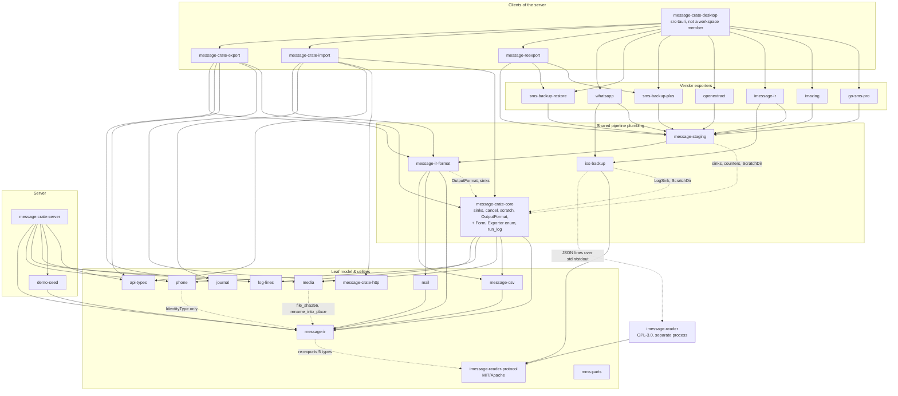
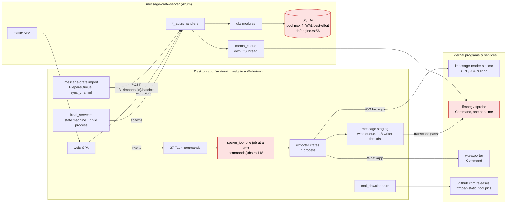

# Initial software design analysis

Date: 2026-10-09. Commit audited: `a4f2a7316` (branch `docs/readme-screenshot-column-width`).
Scope: the whole repository except `web-next/` (legacy, out of the product path by `CLAUDE.md`) and `vendor/` (a byte-identical crates.io copy, `VENDORING.md`).
Method: `cargo metadata` for the crate graph, `madge` for the web import graph, line-count and grep sweeps for size and layering, and four read-only passes over the server, the web app, the desktop host with the pipeline crates, and the exporters with the model crates. Every claim below cites a `path:line` that was read; a claim that could not be confirmed is marked **Unable to verify** with the file that would prove it.

Every path is relative to the repository root. Line numbers are at the audited commit.

## 1. Summary

Message Crate is a layered monolith server, a library stack for turning phone backups into one conversation model, a React single-page app, and a Tauri host that runs the stack in process and supervises the server as a child. The architecture is written down and the rules are enforced: ADRs with reasons, one schema source embedded at compile time, OpenAPI generated from the handlers and checked into TypeScript types by CI, a GPL boundary enforced by `cargo deny`, and a very high test density. The separation of concerns is clear at the crate level and in the persistence layer.

The weaknesses are concentrated in a few places:

- the server's `server.rs` is a God module and the hub of every module cycle in that crate;
- the persistence layer returns the HTTP error type, so `db/` knows about status codes;
- `message-crate-core` is a utility grab-bag that also enumerates every exporter above it;
- the web app's Import Run feature is a 2,084-line module with module-level mutable state and a form duplicated three ways, and two runtime import cycles sit under every query;
- three progress-event vocabularies exist where one should;
- the SMS exporters repeat their projection hooks and their convert skeleton, and one group-key function has forked semantically.

**Modularity: 7/10.** Justification in section 4.5.

## 2. Architecture

### 2.1 Pattern

Not MVC and not microservices. It is:

- **A layered monolith server** (`crates/server/server`): `*_api.rs` route groups → `db/` modules (one per table group) → SQLite. The rule "a handler holds no SQL; every query lives in `db/`" is written at `docs/architecture/http-api.md:882-893` and the production handlers follow it (79 `state.db.acquire()` sites hand a connection to `db::` functions; no `sqlx::query` in a production handler).
- **A library stack for the export pipeline** with an explicit order in `docs/adr/0012-four-crates-in-the-export-pipeline.md`: `message-crate-core` at the bottom, then `message-ir-format`, then `message-staging`, with the vendor exporters on top and `message-reexport` above them.
- **A thin-client SPA** (`web/`) over `/v1`, with one data-access path (TanStack Query over `web/src/lib/serverApi.ts`, `docs/adr/0002`).
- **A desktop host** (`src-tauri/`) that is a process supervisor: it starts the shipped server (`src-tauri/src/local_server.rs`), spawns the GPL Apple Messages reader as a sidecar (`crates/libs/ios-backup/src/helper.rs:138`), downloads ffmpeg/ffprobe/wtsexporter (`src-tauri/src/tool_downloads.rs`), and exposes 37 `#[tauri::command]` functions.

### 2.2 Crate layer diagram

Normal (non-dev) dependencies from `cargo metadata`, grouped by layer. Dashed edges are the ones this report questions.



Observations the diagram makes visible:

- The graph is acyclic (Cargo enforces it) and the ADR 0012 order holds. `ir-format → core` is deliberate, not an inversion.
- `message-crate-core` sits at the bottom but also holds the desktop form model and the list of every exporter that depends on it (finding F3).
- Three leaf edges exist for one or two items each: `phone → ir` for `IdentityType`, `media → ir` for two file helpers, `ir → imessage-reader-protocol` for five re-exported types (finding F12).

### 2.3 Runtime data flow, external integrations, and bottlenecks



Bottlenecks marked in red, with the evidence:

| Where | Evidence | Effect |
|---|---|---|
| SQLite single writer behind a 4-connection pool | `crates/server/server/src/db/engine.rs:56` (`max_connections(4)`), `:20` (`busy_timeout = 15000`), `:63` (WAL best-effort) | Each HTTP import pins one connection for its whole run (`imports_api/mod.rs:1776-1781`), and up to 2 run at once (`:1782`), so half the pool is gone during imports; other writers wait up to 15 s. |
| Import runs on the blocking pool | `imports_api/mod.rs:1761-1766`: `spawn_blocking(move \|\| handle.block_on(run_import_path(..)))` | An async pipeline is driven by `block_on` on a blocking-pool thread; the design comment says why (blocking file IO), but it also means a whole import's awaits are serviced from one OS thread. |
| One desktop job at a time | `src-tauri/src/commands/jobs.rs:118-131` | By design; a second extract waits. |
| Media processing is serial | `crates/libs/media/src/process.rs:90` plain `for` loop; one ffmpeg process per caller; no wall-clock timeout (`tools.rs:387` has only a stop flag) | A hung ffmpeg stalls the pass. |
| Write queue is loaded whole before draining | `crates/libs/staging/src/write_queue.rs:3-5` (doc), `:539` (`Mutex<VecDeque>` filled with every unit) | Memory is bounded by the backup size, not by a channel capacity. |
| Locks held while emitting progress | `write_queue.rs:543-548` (`totals` lock around `add_and_report`), `:599-606` (`units_done` lock around `emit_progress`) | The Tauri event emit runs under the lock. |

External integrations (all through `std::process::Command` or HTTPS):

- ffmpeg/ffprobe: resolved by `crates/libs/media/src/tools.rs:250` (`resolve_tools` → `find_tools` `:309`): `PATH` first, then the Tools Directory; spawned at `tools.rs:424` and `:530`. The server's `demo-seed` also probes with ffprobe (`crates/server/demo-seed/src/assets.rs:238`).
- wtsexporter: `crates/exporters/whatsapp-exporter/src/wtsexporter.rs:273`; has its own `find_wtsexporter`/`is_executable` (`:111-139`) that partly repeats `media/src/tools.rs:250-309`.
- Apple Messages reader sidecar: `crates/libs/ios-backup/src/helper.rs:138`; protocol crate `imessage-reader-protocol`; the GPL rule is checked by `cargo deny` in `audit.yml` (ADR 0014). Confirmed: only `crates/helpers/imessage-reader/Cargo.toml` names `imessage-database` or `crabapple`.
- GitHub release downloads for tools: `src-tauri/src/tool_downloads.rs:437` (`download_client`), `:458` (`download`), URL root `https://github.com/eugeneware/ffmpeg-static/releases/download/`.
- Error documentation URLs under `https://messagecrate.app/docs/developer/reference/errors/` (`crates/server/server/src/problem.rs`).

## 3. Size and health metrics

| Metric | Value |
|---|---|
| Rust in `crates/` | 211,364 lines (35 crates) |
| Rust in `src-tauri/src` | 12,478 lines |
| TypeScript in `web/src` | 94,478 lines, of which 14,072 is the generated `serverApi.types.ts` |
| Server crate | 109,078 lines; `db/` 18,243 non-test; `*_api*` 6,804 non-test |
| Rust tests | 3,137 `#[test]`/`#[tokio::test]` in 273 files |
| Web tests | 192 test files for 349 source files |
| `.unwrap()`/`.expect()` outside `#[cfg(test)]` | server 68, src-tauri 1, core 26, libs 51, exporters 15, helpers 29 |
| `allow(clippy::…)` in non-test code | 3 |
| `biome-ignore` in `web/src` | 0 |
| `any` in non-test, non-generated web code | 4 |
| `unsafe` blocks | `db/write_guard.rs` (SQLite authorizer, test-only), `exit_with_parent.rs` (Windows FFI) |

## 4. The five evaluation questions

### 4.1 Is there clear separation of concerns?

Yes at the macro level, with four leaks:

1. **Persistence knows HTTP.** Six `db/` modules import `crate::server::ApiError` and return it from queries; two implement `From<…> for ApiError`; `db/conversation_messages.rs:392,402,962` construct `ApiError::validation` inside the persistence layer. No `db/` file imports `axum` or `StatusCode`, so the leak is through the error type alone (F2).
2. **`db/` reaches into handler modules.** `db/session_tokens.rs:38` calls `crate::assets_api::sha256_hex`; `db/staging.rs:24` and `db/identity_country.rs:22` import `crate::dedupe::HAS_CONTENT_KEY_SQL` (F2).
3. **SQL outside `db/`.** `dedupe.rs` holds about 20 statements (`:161`, `:218`, `:320`, `:447`, `:588`, `:675`, `:736`, `:998`, `:1120-1141`) and creates a `_content_keys` temp table (`:688`); `reset_demo.rs` has `VACUUM INTO` (`:987`), a checkpoint (`:1029`), verification queries and seeding writes (`:2059`, `:2083`). The repo's own rule at `http-api.md:882-893` says the SQL for a table lives in one place (F7, F13).
4. **In the web app, `lib/` renders UI and `components/` import `screens/`.** `web/src/lib/auth.tsx:12-13` imports `LogoutDialog` and `PathList`; `components/AppLayout.tsx:22-23`, `components/ResultsColumn.tsx:21-22` and `components/LeftPanel.tsx:12` import from `screens/` (F14).

### 4.2 Which architectural pattern is used?

A layered monolith server plus a library pipeline, consumed by a thin SPA and a desktop process supervisor; see 2.1. There is no service bus, no second process other than the GPL sidecar and the shipped server, and no ORM layer (sqlx with hand-written SQL, SQLite only by ADR 0017).

### 4.3 God objects or modules doing too much

| Module | Size | Responsibilities found |
|---|---|---|
| `crates/server/server/src/server.rs` | 1,831 lines | Console macro `say!` (`:47`); auth model and ten `require_*` guards (`:56-290`); extractors (`:291-307`); `auth_guard!` macro and seven newtype guards (`:323-381`); `AppState` (`:385-466`); `Created<T>` (`:472-490`); `ApiError` with `Display`, `IntoResponse` and seven `From` impls (`:498-917`); CORS (`:936`); body limits (`:1009-1080`); `Accept` negotiation (`:1084`); request classifiers (`:1114-1180`); query-log redaction (`:1197-1250`); router assembly including OpenAPI merge, Swagger UI and `ServeDir` (`:1251-1352`); startup, demo seeding and shutdown (`:1354-1525`); health route (`:1526`); credential resolution (`:1535-1690`); body streaming helpers (`:1695-1805`). 29 modules import `ApiError` from it, 17 import `AppState`. |
| `crates/server/server/src/imports_api/mod.rs` | 1,872 lines | Pipeline orchestration with its own pool for the CLI (`:284-556`); wire DTOs and validation (`:557-1138`); eight handlers (`:1139-1781`); concurrency control with a global semaphore and run execution (`:1782-1869`). |
| `crates/server/server/src/reset_demo.rs` | 2,170 lines | Import orchestration (`:808`), address-book load (`:920`), atomic file swap (`:1795-2004`), a ~700-line verifier (`:1100-1790`), account-seeding SQL (`:2032-2100`), console output (`:131`). |
| `crates/server/server/src/test_support.rs` | 1,332 lines, used by 50 files | Fixtures, a real HTTP server, ~30 verb helpers, auth flows, problem assertions, raw-SQL seeding, import helpers, logging helpers. A second fixture `test_state()` lives at `server/tests.rs:142`; `test_support.rs:5` still says it is in `server.rs`. |
| `crates/core/message-crate-core` | crate | Run plumbing (sinks, cancel, scratch, counters) **and** the desktop form (`exporters.rs:23-39` `Exporter`, `config.rs:189-205` `SourceConfig`, `Form::to_config` `:260` with seven `to_*_config` branches) **and** the Import Run log format (`run_log.rs`). |
| `web/src/screens/import/useImportJob.ts` | 2,084 lines | A phase state machine, account handover, work serialisation, Tauri event reduction, server stage writes, session-refusal mapping, run-record persistence with a write queue, media stage, upload and finish, run log, per-source field mapping, run-directory deletion, cancel/discard/resume, copy. Zero React hooks of its own; the state is module-level (`let scratch` `:472`, `let work` `:489`, `let recordWrites` `:633`, `let queuedRecordWrite` `:636`). |
| `web/src/lib/auth.tsx` | 558 lines | Owns the `QueryClient` (`:154`), pushes globals into `api.ts` (`:207-212`), validates the session (`:223`), logs in/out and pauses uploads (`:282-437`), persists to storage (`:101`, `:127`), handles the Tauri window-close flow (`:463-499`), deletes run directories (`:532`), renders `LogoutDialog` and `UndeletedDirectories` (`:506`, `:541`). |
| `src-tauri/src/tool_downloads.rs` | 1,024 lines | Manifest I/O (`:257`, `:266`), hashing (`:342`), HTTP (`:437`, `:458`), permissions (`:537`), shared state with a Condvar (`:570`, `:686`), a file lock (`:785`), threading (`:1015`). |
| `crates/libs/sbr/src/read.rs` | 958 production lines | XML tokenising (`:181`, `:200`, `:814`), base64 MMS part decoding (`:380-460`), address handling (`:659-715`), conversation keying and titling (`:721-784`), owner inference (`:923`). |

Not God modules despite their size: `crates/helpers/imessage-reader/src/emit.rs` (745 production lines, one job: `stream_export` `:60`), `src-tauri/src/local_server.rs` (a pure `step(State, Event)` state machine at `:332` with effects separated in `apply` `:768`).

### 4.4 Is the dependency flow clean?

**Crate level: yes.** The graph is acyclic and follows ADR 0012.

**Module level in the server crate: no.** Mutual references between top-level modules, confirmed on code lines (not doc comments):

| Cycle | Evidence |
|---|---|
| `server ↔ problem` | `server.rs:40` uses `Problem`; `problem.rs:209-210` reads `crate::server::MAX_AUTH_BODY_BYTES`/`MAX_JSON_BODY_BYTES` |
| `server ↔ extract` | `extract.rs:18` `use crate::server::ApiError` |
| `server ↔ credentials` | `credentials.rs:17` `use crate::server::ApiError`; `server.rs:402` holds `credentials::AuthRateLimits` |
| `server ↔ declared_query` | `declared_query.rs:23` `use crate::server::ApiError`; `server.rs:1271,1295` |
| `server ↔ openapi`, `server ↔ server_api`, `server ↔ assets_api` | `AppState` names `server_api::DemoBuild`, `reset_demo::BundleGenerator`, `assets_api::media_links::MediaLinkKey` (`server.rs:413-423`); `ApiError` converts from `assets_api::AssetError` (`:844`) and `imports_api::ImportFailure`/`ImportError` (`:863`, `:882`) |
| `problem ↔ assets_api`, `problem ↔ contacts_api` | `problem.rs:237` reads `assets_api::media_links::MEDIA_LINK_TTL`; `:211,329` read `contacts_api::address_book::MAX_ADDRESS_BOOK_BYTES` |
| `assets_api ↔ asset_store` | `asset_store.rs:77` `use crate::assets_api::Sha256`; `assets_api.rs:25,388` use `asset_store` |
| `media_queue ↔ process_assets` | `media_queue.rs:34,209` |
| `cli ↔ cli_docs` | `cli_docs.rs:36`, `cli.rs:332` (benign) |

Every cycle but the last two passes through `server.rs`, because `ApiError`, `AppState` and the body-size constants live there.

**Web app: two runtime cycles and five type-only ones** (`madge --circular`, 543 files):

1. `lib/auth.tsx:16` imports `createQueryClient` from `lib/routeQuery.ts`; `lib/routeQuery.ts:36` imports `useAuth` from `lib/auth.tsx`. `lib/routeQueryKey.ts` exists to avoid this cycle and has not removed it.
2. `lib/auth.tsx:23` imports `fetchAccountProfileFor` from `lib/useAccountProfile.ts`; `lib/useAccountProfile.ts:4` imports `useAuth`.
3. to 7. type-only: `lib/tauri.ts ↔ lib/types.ts`, `components/import/ImportSummaryPanel.tsx ↔ VirtualizedImportIssuesTable.tsx` (and via `groupImportIssues.ts`), `screens/import/useImportJob.ts ↔ formSnapshot.ts`, `screens/import/importRunStore.ts ↔ useImportJob.ts`.

**`src-tauri`: no module cycles.** But every module is compiled twice: `src/main.rs:13-20` declares them with `mod` and `src/lib.rs:16-23` declares them again with `pub mod`; `main.rs` never uses `message_crate_desktop_lib` (F11).

### 4.5 Modularity: 7/10

Earned:

- Crate boundaries match responsibilities and are documented with reasons (ADRs 0001, 0012, 0014, 0017, 0018). The GPL boundary is a process boundary enforced in CI.
- One schema source (`schema/sql/*.sql`, embedded by `db/schema.rs`); one SQL home (`db/`), followed by every production handler.
- One wire contract: utoipa on the handlers → `docs/src/assets/openapi.json` → `web/src/lib/serverApi.types.ts`, both pinned by CI (`scripts/check-generated-api-types.sh`).
- One data path in the web app with account-scoped keys (`lib/routeQueryKey.ts`; 8 of 10 sampled keys carry the account, the other two are documented).
- Shared write tail (`message-staging::ExportWriter`, `export_writer.rs:31`) replaced the copied tails the exporters used to carry.
- Test-only SQLite authorizer (`db/write_guard.rs`) makes an architectural rule (writes to message tables only inside a transaction) fail a test.

Lost:

- `server.rs` as the cycle hub and the HTTP error type in `db/` (−1).
- `message-crate-core` enumerating its consumers, no exporter trait, hand dispatch in the desktop host, three progress-event types (−1).
- The Import Run feature in the web app: one 2,084-line module with module-level state, a form held three ways, two runtime cycles under every query (−1).

## 5. Findings

Importance is 1–10: 10 means it will cause defects or block change now; 1 is cosmetic.

| ID | Importance | Area | Finding |
|---|---|---|---|
| F1 | 8 | server | `server.rs` is a God module and the hub of every module cycle |
| F2 | 8 | server | `db/` returns the HTTP error type and reaches into handler modules |
| F3 | 7 | core / desktop | `message-crate-core` enumerates every exporter above it; no exporter abstraction; hand dispatch with a dead arm |
| F4 | 7 | web | Import Run feature: God module with module-level state; form duplicated three ways; two runtime import cycles under `auth.tsx` |
| F5 | 6 | web | ADR 0002 compliance drift: fetches outside TanStack Query that the ADR does not name |
| F6 | 6 | pipeline | Three `ProgressEvent` types with incompatible `ProgressFn` aliases |
| F7 | 6 | server | Import run: global semaphore, `block_on` on the blocking pool, connection pinned per run, dedupe SQL outside `db/` |
| F8 | 5 | exporters | Copy-paste across the SMS exporters: projection hooks, conversation grouping, attachment queueing, convert skeleton, CSV writers |
| F9 | 5 | exporters | `sbr::group_chat_key` forked from `phone::group_chat_id` and lost its collision guard |
| F10 | 5 | server tests | `test_support.rs` fixture God module; a second fixture; stale doc |
| F11 | 4 | desktop | Every `src-tauri` module compiled twice; `Result<_, String>` at 73 sites; `tool_downloads.rs` mixes seven jobs |
| F12 | 4 | model crates | `message-ir` is not a pure model; three leaf edges exist for one or two items |
| F13 | 4 | server / demo | Demo seed contract duplicated between `reset_demo.rs` and `demo-seed`; `reset_demo.rs` holds SQL |
| F14 | 4 | web | Layer inversions (`lib/` renders UI, `components/` import `screens/`); a hand-kept second route table; `hooks/` vs `lib/` split is arbitrary |
| F15 | 3 | web | Copy-paste: membership toolbar drifted; error-to-text at 35 sites; desktop-read-in-effect ×5 |
| F16 | 3 | workspace | Dead or misplaced code: `contacts` crate (documented hold), `csv::Zone`, `scripts/deprecated/`, `SourceConfig::Format` arm |
| F17 | 3 | pipeline | Write queue loaded whole; progress emitted under locks; serial media pass without a timeout; child spawned under a mutex |
| F18 | 3 | server | Schema check on every authenticated request |
| F19 | 2 | pipeline | Cancellation is a typed error in core but documented as a message string in an exporter |

### F1. `server.rs` is a God module and the cycle hub (8/10)

**Evidence.** Section 4.3 row 1 and section 4.4. The decisive numbers: 29 modules import `crate::server::ApiError`, 17 import `AppState`, and `problem.rs:209-210` has to read body-size constants out of the router module to write an error sentence.

**Why it matters.** Every change to error mapping, auth, middleware or startup touches the same 1,831-line file, and every module that needs an error type depends on the module that builds the router. The cycles mean no part of the server can be unit-tested or moved without the whole.

**Remediation.** Split by the blocks that already have clean boundaries, and re-export from `server.rs` so no call site changes in the first step.

```rust
// crates/server/server/src/lib.rs (add)
pub mod api_error;   // ApiError, Display, IntoResponse, the From impls  (server.rs:498-917)
pub mod auth;        // AuthCapability, AuthIdentity, require_*, extractors, auth_guard! (server.rs:56-381, 1535-1690)
pub mod limits;      // MAX_AUTH_BODY_BYTES, MAX_JSON_BODY_BYTES, MAX_ADDRESS_BOOK_BYTES, MEDIA_LINK_TTL
pub mod middleware;  // CORS, body limits, Accept, classifiers, redaction (server.rs:919-1250)
pub mod startup;     // run, serve_until_shutdown, shutdown_signal (server.rs:1354-1525)

// crates/server/server/src/server.rs keeps AppState and http_app, and re-exports for now:
pub use crate::api_error::ApiError;
pub use crate::auth::{AuthIdentity, FullAccess, FullDeleteAccess, LoggedIn, Owner, ExportAccess};
pub use crate::limits::{MAX_AUTH_BODY_BYTES, MAX_JSON_BODY_BYTES};
```

Then move the per-module `From<X> for ApiError` impls (`identity_country.rs:73`, `accounts_api.rs:586`, `search/error.rs:60`, `contacts_api/edit.rs:57`, `contacts_api/address_book.rs:82`) next to the error types they convert, which `api_error` can do without importing handler modules only after F2 is done. `problem.rs` then imports `crate::limits` and the `problem ↔ assets_api`/`contacts_api`/`server` cycles disappear.

### F2. `db/` returns the HTTP error type and reaches into handlers (8/10)

**Evidence.**

- `db/conversations.rs:16` (7 uses), `db/conversation_messages.rs:31` (16 uses, with `ApiError::validation` at `:392`, `:402`, `:962`), `db/contacts/read.rs:16`, `db/exports.rs:19,485`.
- `db/saved_searches.rs:66` and `db/named_membership.rs:38` implement `From<…> for crate::server::ApiError`.
- `db/session_tokens.rs:38` calls `crate::assets_api::sha256_hex` (defined at `assets_api.rs:162`); `asset_store.rs:77` imports `assets_api::Sha256` (`assets_api.rs:105`).
- `db/staging.rs:24`, `db/identity_country.rs:22` import `crate::dedupe::HAS_CONTENT_KEY_SQL`.

**Why it matters.** The persistence layer can only be reused by code that speaks HTTP errors (the CLI import path at `imports_api/mod.rs:284` already pays this), and a status-code decision made in `db/` cannot be seen from the handler that the rules say "checks the caller and shapes the answer" (`http-api.md:882`).

**Remediation.** Give `db/` its own error, map once.

```rust
// crates/server/server/src/db/error.rs
#[derive(Debug, thiserror::Error)]
pub enum DbError {
    #[error("{0}")]
    Validation(String),          // replaces ApiError::validation(..) at conversation_messages.rs:392,402,962
    #[error("{0}")]
    NameTaken(String),           // replaces the From impls in saved_searches.rs:66, named_membership.rs:38
    #[error(transparent)]
    Sqlx(#[from] sqlx::Error),
    #[error(transparent)]
    Other(#[from] anyhow::Error),
}
pub type DbResult<T> = Result<T, DbError>;

// crates/server/server/src/api_error.rs (one mapping, next to ApiError)
impl From<crate::db::DbError> for ApiError {
    fn from(e: crate::db::DbError) -> Self {
        use crate::db::DbError::*;
        match e {
            Validation(s) => ApiError::validation(s),
            NameTaken(s) => ApiError::NameTaken(s),
            Sqlx(e) => ApiError::Internal(e.into()),
            Other(e) => ApiError::Internal(e),
        }
    }
}
```

Move `Sha256` and `sha256_hex` (`assets_api.rs:105,162`) into `crates/server/server/src/sha256.rs`, imported by `assets_api`, `asset_store`, `asset_uploads` and `db/session_tokens`. Move `HAS_CONTENT_KEY_SQL` and the ~20 statements in `dedupe.rs` into `db/dedupe.rs`, leaving `dedupe.rs` as the sequencing stage the http-api document describes for import stages (`:890-893`).

### F3. core enumerates its consumers; no exporter abstraction (7/10)

**Evidence.**

- `crates/core/message-crate-core/src/exporters.rs:23-39` `pub enum Exporter { GoSmsPro, Imazing, Imessage, OpenExtract, SmsBackupRestore, SmsBackupPlus, Whatsapp }`; module doc: "Backup-type forms, dropdown labels, and validation used by the desktop app".
- `config.rs:189-205` `pub enum SourceConfig` with one variant per vendor plus `Format`; `Form::to_config` (`exporters.rs:260`) branches to seven `to_*_config` functions (`:310-566`).
- No `pub trait` for an exporter exists in core, staging or ir-format (the only trait is `MergedArchive`, `ir-format/src/format_sink.rs:21`). Every exporter exposes `pub fn run(config: &ExporterConfig) -> Result<RunResult>` by convention (`go-sms-pro-exporter/src/run.rs:13`, `whatsapp-exporter/src/run.rs:27`, `imessage-ir-exporter/src/run.rs:177`, …).
- The desktop host dispatches by hand: `src-tauri/src/commands/extract.rs:528-538` `run_exporter` matches `SourceConfig`; the `SourceConfig::Format` arm returns `Err("Format conversion not yet wired")` (`:537`) because `format` goes through `message_reexport::run` (`commands/format.rs:81`).
- The lower crates depend on core only for plumbing: `ir-format` for `OutputFormat`, `ExportTransforms`, `LogSink`, `ProgressSink`, `CancelFlag`, `check_cancel`, `emit_log`, `emit_progress`, `discover_files` (`ir-format/src/write.rs:6`, `format_sink.rs:11,240-254`, `read_mail.rs:5`); `ios-backup` for `LogSink`, `ProgressSink`, `ScratchDir` (`backup_domain.rs:13`, `identity.rs:18`, `helper.rs:27`); `staging` for sinks, counters, `ScratchDir`, `MediaConfig` (`counted_attachments.rs:8-11`, `write_queue.rs:35-38`, `spool.rs:24`, `transcode.rs:97`).
- ADR 0012 accepts the form model in core on purpose ("It also holds the desktop app's form model").

**Why it matters.** Adding a backup type means editing core (`Exporter`, `SourceConfig`, `Form::to_config`), the desktop match, and the exporter, and nothing checks the three agree. `ios-backup` pulls in the form model and the run-log format to get a log sink.

**Remediation.** Two steps; the first is small.

```rust
// crates/core/message-crate-core/src/exporter.rs (new): the abstraction that is already a convention
pub trait Exporter: Send + Sync {
    fn run(&self, config: &ExporterConfig) -> anyhow::Result<RunResult>;
}
impl<F> Exporter for F where F: Fn(&ExporterConfig) -> anyhow::Result<RunResult> + Send + Sync {
    fn run(&self, config: &ExporterConfig) -> anyhow::Result<RunResult> { self(config) }
}

// src-tauri/src/commands/extract.rs: the registry lives with the only crate that links every exporter
fn exporter_for(source: &SourceConfig) -> Option<&'static dyn message_crate_core::Exporter> {
    Some(match source {
        SourceConfig::GoSmsPro(_) => &go_sms_pro_exporter::run,
        SourceConfig::SmsBackupRestore(_) => &sms_backup_restore_exporter::run,
        SourceConfig::SmsBackupPlus(_) => &sms_backup_plus_exporter::run,
        SourceConfig::OpenExtract(_) => &openextract_exporter::run,
        SourceConfig::Imazing(_) => &imazing_exporter::run,
        SourceConfig::Apple(_) => &imessage_ir_exporter::run,
        SourceConfig::Whatsapp(_) => &whatsapp_exporter::run,
        SourceConfig::Format(_) => return None, // handled by commands/format.rs; no "not yet wired" string
    })
}
```

Second step: split `message-crate-core` into `message-crate-run` (process, progress, scratch, counter, attachment_jobs, transforms, pipeline, run) that `ir-format`, `staging` and `ios-backup` depend on, and keep `config`, `exporters` (the form) and `run_log` in `message-crate-core` above the exporters. This needs an ADR 0012 amendment, which is in scope for a change this size.

### F4. Import Run feature in the web app (7/10)

**Evidence.**

- `web/src/screens/import/useImportJob.ts` (2,084 lines) calls no `useState`/`useRef`/`useEffect`; its state is module-level: `let scratch` `:472`, `let work` `:489`, `let recordWrites` `:633`, `let queuedRecordWrite` `:636`. About 60 module-level functions cover the responsibilities listed in 4.3. The hook itself is a facade (`:1766-2084`).
- The form exists three times: 33 `useState` calls in `screens/ImportScreen.tsx` (fields at `:203-236`, assembled into `ImportJobFormValues` at `:800-824`, refilled at `:311-330`); `ImportJobFormValues` in the store (`useImportJob.ts:2051`) and `scratch.form`; the server snapshot (`screens/import/formSnapshot.ts:26`). `ImportFormFieldsProps` (`screens/import/ImportFormFields.tsx:66-132`) carries about 60 value/`onXChange` pairs.
- Runtime cycles: `lib/auth.tsx:16 ↔ lib/routeQuery.ts:36`, `lib/auth.tsx:23 ↔ lib/useAccountProfile.ts:4` (madge).

**Why it matters.** Module-level mutable state in an ES module is a process-wide singleton: tests must reset it, two mounted hooks share it, and hot reload keeps it. A new form field is added in five places. The cycles mean `routeQuery.ts`, which every query goes through, cannot be imported without `auth.tsx` and its two component imports.

**Remediation.**

```ts
// web/src/lib/authContext.ts (new): break both runtime cycles
import { createContext, useContext } from "react";
export const AuthContext = createContext<AuthContextValue | null>(null);
export function useAuth() {
  const v = useContext(AuthContext);
  if (!v) throw new Error("useAuth outside AuthProvider");
  return v;
}
// lib/routeQuery.ts:36 and lib/useAccountProfile.ts:4 import useAuth from "./authContext";
// lib/auth.tsx keeps the provider and imports AuthContext from "./authContext".
```

```ts
// web/src/screens/ImportScreen.tsx: one form value, one reducer, instead of 33 useState calls
type FormAction = { [K in keyof ImportJobFormValues]: { field: K; value: ImportJobFormValues[K] } }[keyof ImportJobFormValues];
function formReducer(s: ImportJobFormValues, a: FormAction): ImportJobFormValues {
  return { ...s, [a.field]: a.value };
}
const [form, dispatch] = useReducer(formReducer, initialForm);
// ImportFormFields takes `form` and `onChange={dispatch}`; formSnapshot restores by one dispatch per field.
```

For `useImportJob.ts`: lift `scratch`/`work`/the record-write queue and the stage runners into `screens/import/importRunService.ts` built by a factory that takes `{ tauri, serverApi }` ports, created once in `importRunStore.ts`; the hook stays the facade. That makes the service testable with fakes and removes the singleton.

### F5. ADR 0002 compliance drift (6/10)

**Evidence.** ADR 0002 says at `:16-17` the two named exceptions "are the only ones. Any other fetch outside TanStack Query is a violation of this decision." The two are attachment bytes (`hooks/useAssetObjectUrl.ts`, `serverApi.ts:479`) and the pre-login health probe (`lib/serverHealth.ts:56`). Outside those:

- `web/src/lib/useSearchSuggestions.ts:90-108`: `listContacts(...)` inside `useEffect` with a hand-rolled 150 ms debounce, `AbortController` and `setContacts`.
- `screens/import/useImportJob.ts`: `getServerState` `:1530`, `createImport` `:1586`, `completeImport` `:1082`, `moveStage` `:951`. `lib/routeQuery.ts:52` acknowledges "The Import Run's own server calls, made outside TanStack Query", but the ADR does not.
- `lib/auth.tsx:223` calls `getSession()` directly in an effect.
- Desktop reads in effects: `screens/settings/SystemSection.tsx:378-391`, `:432-446`; `screens/import/ImportRunView.tsx:217-240`; `screens/ImportScreen.tsx:271-309` and around `:466-600`. `lib/useToolsStatus.ts:27` shows these can be queries.

**Remediation.**

```ts
// web/src/lib/useSearchSuggestions.ts: a query instead of an effect
const debounced = useDebouncedValue(valuePart, 150);
const { data } = useRouteQuery(
  keys.contacts.suggest(debounced),
  ({ signal }) => listContacts({ q: debounced, limit: 20, offset: 0 }, { signal }),
  { enabled: personOp, placeholderData: keepPreviousData },
);
const contacts = data?.items.map((c) => ({ id: String(c.id), name: c.name })) ?? [];
```

And one ADR edit: add "An Import Run's own stage writes" as a third named exception with the reason at `routeQuery.ts:48-52`, or move them into mutations. Either is consistent; the current state is neither.

### F6. Three `ProgressEvent` types (6/10)

**Evidence.** `crates/core/message-crate-core/src/progress.rs:23`, `crates/libs/import/src/progress.rs:45`, `crates/libs/export/src/run.rs:92`. The function aliases disagree on `Send`: `import/progress.rs:93` `dyn FnMut(ProgressEvent) + Send + 'a`, `export/run.rs:114` `dyn FnMut(ProgressEvent) + 'a`. Retries also differ: export uses `with_retries(MAX_RETRIES, ..)` (`export/src/run.rs:370,402,469,851`), import uses `session.request(cfg.max_retries, ..)` (`prepare.rs:899,913`) or `with_retries` (`import/run.rs:199`).

**Remediation.** One event type in the shared layer, with a source tag, and one `ProgressFn` that is `Send` (the desktop host already runs jobs on a thread, `commands/jobs.rs:123`).

```rust
// crates/core/message-crate-core/src/progress.rs
pub enum ProgressEvent { /* existing variants */ Import(ImportProgress), Export(ExportProgress) }
pub type ProgressFn<'a> = dyn FnMut(ProgressEvent) + Send + 'a;
// import/src/progress.rs and export/src/run.rs: `pub use message_crate_core::progress::{ProgressEvent, ProgressFn};`
```

### F7. Import run concurrency and SQL placement (6/10)

**Evidence.**

- `imports_api/mod.rs:1784-1787` `static SEMAPHORE: OnceLock<tokio::sync::Semaphore>`, process-global, shared by every test, while `server.rs:403-405` keeps the auth rate limiter in `AppState` "not in a static" for exactly that reason.
- `:1761-1766` `spawn_blocking(move || handle.block_on(run_import_path(..)))`.
- `:1776-1781` each run holds one pooled connection for its whole duration; pool is 4 (`db/engine.rs:56`); 2 imports may overlap (`:1782`).
- `dedupe.rs` SQL outside `db/` (section 4.1 item 3), run from `:1849`.
- Per-account `tokio::sync::Mutex` held across the import by design (`keyed_locks.rs:15,37`, `imports_api/mod.rs:1817`). No `std::sync::Mutex` guard was found held across an `.await`.

**Remediation.**

```rust
// server.rs AppState: own the limit, like auth_rate_limits
pub(crate) import_slots: std::sync::Arc<tokio::sync::Semaphore>,   // Semaphore::new(MAX_CONCURRENT_IMPORTS)
// imports_api/mod.rs: let _slot = state.import_slots.clone().acquire_owned().await?;  and delete import_semaphore()
```

Move the ~20 statements from `dedupe.rs` into `db/dedupe.rs` (the stage keeps the sequencing). **Unable to verify:** how long write transactions stay open during staging and promote; `db/write_tx.rs`, `imports_api/staging.rs` and `imports_api/promote.rs` would show it, and that decides whether a dedicated import connection outside the pool is worth it.

### F8. Copy-paste across the SMS exporters (5/10)

**Evidence.**

- `GoSmsProjection` (`crates/exporters/go-sms-pro-exporter/src/emit.rs:328-398`) and `SbpProjection` (`crates/exporters/sms-backup-plus-exporter/src/emit.rs:242-310`): `export`, `service` (fixed `IrService::Sms`), `normalize_handle` (go `:342-344`, sbp `:256-258`) and `participants` (go `:346-355`, sbp `:261-270`) are identical; the `android_group_title` + `parse_android_type` tail of `source` is duplicated (go `:386-396`, sbp `:295-308`).
- `ensure_convo` (`sms-backup-plus-exporter/src/emit.rs:154-176`) re-implements `message_ir::ensure_conversation` (`crates/libs/ir/src/projection.rs:467-477`) with a `HashMap` and a merge of `participant_e164s`; go-sms-pro uses the shared one (`emit.rs:124,217`).
- Attachment queueing: `queue_pdu_attachments` (`go-sms-pro-exporter/src/attachments_emit.rs:20-47`), `queue_attachments` (`sms-backup-plus-exporter/src/attachments_emit.rs:17-40`), and a third shape in `sms-backup-restore-exporter/src/read.rs:317-336`.
- The `convert_export` skeleton (prepare_outputs → `ExportWriter::open` → ingest with `check_cancel` → `export_meta` → `project_conversation` loop → `finish`) is ~30 lines repeated: go `emit.rs:426-509`, imazing `emit.rs:114-216`, sbp `emit.rs:461-575`.
- Three near-identical CSV writers in go-sms-pro: `emit.rs:630`, `:675`, `:699`.
- Module names differ per crate (`read`/`parse`/`xml`/`parse_emit`; `convert`/`emit`); imessage-ir shadows `PendingConversation` and `pending_to_document` (`convert.rs:60`, `:718`); whatsapp uses `ConvertRequest`/`convert_json` (`emit.rs:32,63`) where the others use `ConvertExportArgs`/`convert_export`.

**Remediation.**

```rust
// crates/core/message-crate-core/src/android_sms.rs (new): the hooks both SMS exporters share
pub struct AndroidSmsProjection<'a> { pub owner: &'a OwnerHandleSet, pub export_name: &'static str }
impl ProjectionHooks for AndroidSmsProjection<'_> {
    fn export(&self) -> &str { self.export_name }
    fn service(&self, _: &PendingConversation) -> IrService { IrService::Sms }
    fn normalize_handle(&self, raw: &str) -> String { /* body of go emit.rs:342-344 */ }
    fn participants(&self, c: &PendingConversation) -> Vec<IrParticipant> { /* body of go emit.rs:346-355 */ }
    fn source(&self, c: &PendingConversation) -> IrSource { /* shared tail of go emit.rs:386-396 */ }
}
```

Delete `ensure_convo` in favour of `message_ir::ensure_conversation` (adding the `participant_e164s` merge there if both need it), and add `run_convert_export(args, ingest: impl FnMut(..))` in core that owns the 30-line skeleton.

### F9. `sbr::group_chat_key` forked from `phone::group_chat_id` (5/10)

**Evidence.** `crates/libs/sbr/src/read.rs:773-784` builds `format!("group-{}", peers.join("_"))` with a hash fallback over 180 bytes. `crates/libs/phone/src/lib.rs:679-700` builds a length-prefixed slug (`group_id_slug`) precisely so that `["12","34"]` and `["123","4"]` cannot collide, with the same 180-byte hash rule; `group_title` in sbr (`:754-765`) repeats the title logic in `phone` (`:688-698`). go-sms-pro (`emit.rs:259`) and sms-backup-plus (`flat_eml.rs:345`) use the phone version. **Unable to verify** whether a collision occurs with real SMS Backup & Restore inputs: it needs two different rosters whose `_`-joins are equal, which an email handle containing `_` allows; `sbr/src/read.rs:721-750` builds the keys.

**Remediation.**

```rust
// crates/libs/sbr/src/read.rs: replace group_title + group_chat_key
let others: Vec<String> = peers.iter().map(|p| p.to_string()).collect();
let (chat_id, title) = phone::group_chat_id("group-", &others);
```

### F10. Server test fixture God module (5/10)

**Evidence.** `crates/server/server/src/test_support.rs` (1,332 lines, `#[cfg(test)]` only, `lib.rs:55-56`) is used by 50 files and mixes fixtures (`:25`, `:107`, `:129`), a real HTTP server (`:71`, `:79`), ~30 verb helpers (`:380`-`:765`), auth flows (`:256`, `:303`, `:343`), `expect_problem` (`:454`), raw-SQL seeding (`:93`, `:827`, `:971`, `:1023`), import helpers (`:1091`, `:1127`) and logging helpers (`:1179-1212`). A second fixture `test_state()` lives at `server/tests.rs:142` with `test_app_state` at `server.rs:1810`; `test_support.rs:5` says `test_state()` is in `server.rs`. The repo's rule requires shared fixtures (`http-api.md:902-904`), so the module's existence is right; its shape is not.

**Remediation.** Keep the name, split the file: `test_support/{mod.rs, fixture.rs, http.rs, seed.rs, log.rs}` with `pub use` from `mod.rs`, and move `test_state()` in. Fix the comment at `:5`.

### F11. `src-tauri` structure (4/10)

**Evidence.**

- `src-tauri/src/main.rs:13-20` declares eight modules with `mod`; `src/lib.rs:16-23` declares the same eight with `pub mod`; `lib.rs:13-14` says "Both declare the same modules." `main.rs` does not reference `message_crate_desktop_lib`, so every module and its tests compile twice (`Cargo.toml:8-10` builds `lib`, `cdylib`, `staticlib`).
- Commands return `Result<_, String>` at 73 sites with 23 ad-hoc `to_string()`/`format!` conversions; long jobs use one shared path (`commands/jobs.rs:118-131`, panic caught at `:140`) and `ExtractErrorEvent { detail, user_message }` (`commands/events.rs:226,234`).
- `tool_downloads.rs` mixes seven jobs (section 4.3).
- `local_server.rs:778-781,813` starts the child process with the `Inner` mutex held.

**Remediation.**

```rust
// src-tauri/src/lib.rs: own the app
pub fn run() { /* body of main() from main.rs:31 onward */ }

// src-tauri/src/main.rs: the whole file
#![cfg_attr(not(debug_assertions), windows_subsystem = "windows")]
fn main() { message_crate_desktop_lib::run(); }
```

```rust
// src-tauri/src/commands/error.rs: one serialisable command error instead of String
#[derive(serde::Serialize)]
pub struct CommandError { pub kind: &'static str, pub detail: String, pub user_message: Option<String> }
impl From<anyhow::Error> for CommandError {
    fn from(e: anyhow::Error) -> Self { Self { kind: "failed", detail: format!("{e:#}"), user_message: None } }
}
```

### F12. `message-ir` is not a pure model; one-item leaf edges (4/10)

**Evidence.**

- Not model: `file_sha256` (`crates/libs/ir/src/lib.rs:931-948`, streams a file); `write_atomic`/`rename_into_place` re-exported from `durable.rs` at `:33` (fsync + rename; the module doc at `:5-7` admits the placement); `format_local_ts` (`:906-922`) uses `chrono::Local`; file-naming policy `conversation_stem` `:827`, `give_each_document_its_own_file` `:753`; Android-specific `parse_android_type` `:986`; the 905-line `projection.rs` pipeline.
- `media → message-ir` only for `file_sha256` (`media/src/lib.rs:273-280`) and `rename_into_place` (`media/src/process.rs:736,743`).
- `phone → message-ir` only for `IdentityType` (`phone/src/lib.rs:20`; a plain four-variant enum at `ir/src/lib.rs:224-256`).
- `message-ir → imessage-reader-protocol` for five `pub use` re-exports (`ir/src/lib.rs:53,60,70,79,88`: `Reaction`, orphaned-chat items, `Deletion`, `EarlierVersion`, `ReplyTo`); no protocol item is used. ADR 0014 sanctions the shared permissive crate; the cost is that the model's vocabulary lives in a crate named after one source's transport, and every model consumer transitively pulls `bare_address`, `HELPER_NAME` and the like.

**Remediation.** Move `durable.rs` and `file_sha256` into a small `fs-util` crate (`media` and `ir` depend on it; `media → ir` disappears). Define `IdentityType` in `phone` and `pub use phone::IdentityType` from `message-ir` (the edge inverts). Move the five shared types into `message-ir-shared-types` (MIT OR Apache-2.0) that both `imessage-reader-protocol` and `message-ir` depend on; ADR 0014 stays satisfied.

### F13. Demo seed contract duplicated; `reset_demo.rs` holds SQL (4/10)

**Evidence.** `IMESSAGE_SOURCE`, `SBR_SOURCE`, `WHATSAPP_SOURCE` defined at `crates/server/server/src/reset_demo.rs:40-42` and `crates/server/demo-seed/src/lib.rs:30-32`. `seed.toml` is written with `format!` (`demo-seed/src/contacts.rs:79-97`) and read by private serde structs `DemoSeed`, `DemoOwner`, `DemoAccount` (`reset_demo.rs:62-85`); no shared type. The generic `move_path`/`move_path_with` (`demo-seed/src/lib.rs:360-371`) lives in the seed crate and the server's swap uses it (`reset_demo.rs:1804`). SQL in `reset_demo.rs` at `:987`, `:1029`, `:1212`, `:1266-1283`, `:2059`, `:2083`.

**Remediation.**

```rust
// crates/server/demo-seed/src/manifest.rs (new, pub): the one contract
#[derive(serde::Serialize, serde::Deserialize)]
pub struct SeedManifest { pub owner: SeedOwner, pub accounts: Vec<SeedAccount>, pub sources: Vec<SeedSource> }
pub const IMESSAGE_SOURCE: &str = "imessage";  // delete the copies in reset_demo.rs:40-42
```

`demo-seed` writes it with `toml::to_string`, `reset_demo.rs` reads it with `toml::from_str`. Move the seeding and verification statements into `db/demo.rs`.

### F14. Web layer inversions and a second route table (4/10)

**Evidence.**

- `web/src/lib/auth.tsx:12-13` imports `LogoutDialog` and `PathList` from `components/`. `lib/conversationSort.ts:1`, `lib/messageSearchSort.ts:1`, `lib/namedSetCopy.ts:1` import types from `components/`.
- `components/AppLayout.tsx:22-23`, `components/ResultsColumn.tsx:21-22`, `components/MessageRoute.tsx:15`, `components/LeftPanel.tsx:12`, `components/ImportExportRoute.tsx:12` import from `screens/`.
- `App.tsx:74-80` renders the browse routes with `element={null}`; `components/AppLayout.tsx:45-61` `modeFromPathname` then re-derives the mode from the path string. `AppLayout.tsx` also maps URL parameters to search state (`:150-162`), navigates per mode (`handleSearch` `:199-230`) and resolves group/tag slugs (`:138-149`).
- `hooks/` has 6 files; about 25 hooks live in `lib/` (112 files). `lib/chatBubbleShared.test.ts` tests `components/messages/chatBubbleShared.tsx`.

**Remediation.** Give each browse route its own element in `App.tsx` and delete `modeFromPathname`; move the URL-parameter logic into `hooks/useBrowseLocation.ts`; move `SortOrder` into `lib/`; pass the logout UI into `AuthProvider` as a render prop; pick one home for hooks.

### F15. Web copy-paste (3/10)

**Evidence.** Membership toolbar duplicated and drifted: `screens/ConversationList.tsx:114-160` runs "clear all" removals one after another (`:147-154`); `screens/ContactList.tsx:337-395` uses `Promise.allSettled` (`:357-359`). `instanceof Error ? x.message : String(x)` at 35 sites (for example `screens/settings/ProfileSettingsPanel.tsx:47,59`, `screens/ExportScreen.tsx:191`) although `lib/apiErrorMessage.ts:10` exists. Desktop-read-in-effect with a `live`/`cancelled` flag: `SystemSection.tsx:378-391`, `ImportRunView.tsx:226-240`, `ImportScreen.tsx:273,476,532,567`. Date formatting outside `lib/formatDate.ts`: `components/messages/chatBubbleShared.tsx:35`, `screens/message/threadLayout.ts:9,23`.

**Remediation.**

```ts
// web/src/lib/errorText.ts
export const errorText = (e: unknown) => (e instanceof Error ? e.message : String(e));
// web/src/hooks/useDesktopQuery.ts: wrap invoke* in useQuery like lib/useToolsStatus.ts:27 already does
export const useDesktopQuery = <T>(key: readonly unknown[], fn: () => Promise<T>) =>
  useQuery({ queryKey: ["desktop", ...key], queryFn: fn, staleTime: Infinity });
```

### F16. Dead or misplaced code (3/10)

- `crates/libs/contacts` has zero dependents; `src/lib.rs:4-6` says nothing calls it until issue #916. It is a documented hold, not an accident, but it is still compiled and audited for nothing. Keep or move behind a feature; either is fine, the issue should name the choice.
- `crates/libs/csv` holds `Zone` (`zone.rs`, `utc_offset.rs`) used only by imazing (`emit.rs:22`, `parse_emit.rs:7`); move it to the imazing exporter.
- `scripts/deprecated/` holds three files (`regen-search-goldens-worker.ts`, `regen-search-goldens.mjs`, `setup-demo.sh`).
- `SourceConfig::Format` arm in `src-tauri/src/commands/extract.rs:537` is unreachable by design; see F3.
- Two MIME lookups: `media::mime_for_ext` (`media/src/mime.rs:79`) and `mime_for_rel` (`core/src/attachment_jobs.rs:414`).

### F17. Pipeline bottlenecks (3/10)

Listed in 2.3 with evidence. Remediation for the two that are cheap:

```rust
// crates/libs/staging/src/write_queue.rs:543-548 and :599-606: emit after the lock is released
let snapshot = { let mut t = totals.lock().unwrap(); t.add(unit); t.snapshot() };
emit_progress(&sink, snapshot);
```

For the whole-load queue: a `std::sync::mpsc::sync_channel(writer_count * 2)` fed by the ingest loop bounds memory by the channel, not the backup. For ffmpeg: a wall-clock cap in `run_ffmpeg_until` (`media/src/tools.rs:387`) next to the stop flag.

### F18. Schema check on every authenticated request (3/10)

`server.rs:1620` `resolve_auth_on_conn` calls `schema::ensure_accounts_schema` on each authenticated request; so do `session_api.rs:273` and five `accounts_api/api_tokens.rs` handlers (`:156`, `:223`, `:264`, `:322`, `:373`). The body (`db/schema.rs:596-601`) is one `PRAGMA user_version` read and a rebuild only on a fingerprint mismatch, so the cost is small. The smell is placement: schema repair belongs at startup (`server.rs:1376-1379` already runs it) and in the CLI's own pool opening (`imports_api/mod.rs:297`), not on the auth path. Remove the per-request call once both entry points are confirmed to run it.

### F19. Cancellation shape (2/10)

Core has a typed `Cancelled` (`crates/core/message-crate-core/src/process.rs:57`), while `go-sms-pro-exporter/src/emit.rs:420` documents "Cancelled runs return an error with message `cancelled`". **Unable to verify** whether any caller matches on the text rather than downcasting; `src-tauri/src/commands/jobs.rs` and `commands/extract.rs` would show it. If one does, replace it with `err.downcast_ref::<Cancelled>().is_some()`.

## 6. Anti-pattern checklist

| Anti-pattern | Present? | Where |
|---|---|---|
| Spaghetti code | Localised | Server module cycles through `server.rs` (F1); two runtime cycles under `auth.tsx` (F4). No cycles at the crate level, none in `src-tauri`. |
| Copy-paste programming | Yes | SMS exporter hooks, grouping, attachment queueing, convert skeleton (F8); forked group key (F9); three progress types (F6); demo seed constants (F13); web membership toolbar, error text, effect reads (F15). |
| God classes/modules | Yes | `server.rs`, `imports_api/mod.rs`, `reset_demo.rs`, `test_support.rs`, `message-crate-core`, `useImportJob.ts`, `auth.tsx`, `tool_downloads.rs`, `sbr/read.rs` (4.3). |
| Tight coupling | Yes | `db/` → `ApiError` (F2); core → every exporter (F3); `lib/` → `components/`, `components/` → `screens/` (F14); screens calling `lib/tauri.ts` directly and `PathPicker.tsx:1`, `openPath.ts:1`, `saveFile.ts:1`, `localServer.ts:1` bypassing it. |
| Missing abstractions | Yes | No exporter trait or registry (F3); no `db` error type (F2); no shared command error in `src-tauri` (F11); no shared progress type (F6); no `errorText`/`useDesktopQuery` (F15). |

## 7. What is done well

- Decisions are written with reasons and the code is checked against them: ADRs, `docs/architecture/http-api.md`, the OpenAPI → TypeScript gate, the version-lockstep check, `cargo deny` for the GPL boundary.
- One schema source embedded at compile time; the test-only SQLite authorizer in `db/write_guard.rs` turns a transactional rule into a failing test.
- `src-tauri/src/local_server.rs` separates a pure state machine from its effects; `message-staging::ExportWriter` is the shared write tail the exporters used to copy; the desktop host reaches the UI only through sink closures, so no pipeline crate links Tauri.
- Discipline metrics are strong: 3 clippy allows, 0 biome ignores, 4 `any`, 68 unwraps outside tests in a 109k-line server crate, 3,137 Rust tests and 192 web test files.

## 8. Unable to verify

| Claim | Proving file(s) |
|---|---|
| How long write transactions stay open during staging and promote (decides the weight of F7) | `crates/server/server/src/db/write_tx.rs`, `imports_api/staging.rs`, `imports_api/promote.rs` |
| Whether `message-staging` runs `transcode_file` in parallel | `crates/libs/staging/src/transcode.rs:677` |
| Whether a `_`-joined group key collides on real SMS Backup & Restore inputs (F9) | `crates/libs/sbr/src/read.rs:721-750` with a fixture containing an email handle with `_` |
| Whether any caller matches cancellation by message text (F19) | `src-tauri/src/commands/jobs.rs`, `src-tauri/src/commands/extract.rs` |
| Whether `tool_downloads` reaches the UI by any route other than `tools_status`/`retry_tool_downloads` | `src-tauri/src/commands/tools.rs`, `src-tauri/src/tool_downloads.rs` |

## 9. Suggested order of work

1. F2 then F1: a `db` error type and the `server.rs` split remove every cycle in the server crate and are mechanical.
2. F4 (the `authContext.ts` extraction is a 20-line change that removes both web runtime cycles; the form reducer and the service extraction follow).
3. F6 and F9: small, and each removes a real divergence.
4. F3 step one (the trait and the registry); step two with an ADR 0012 amendment.
5. F8, F13, F11, then the rest.
