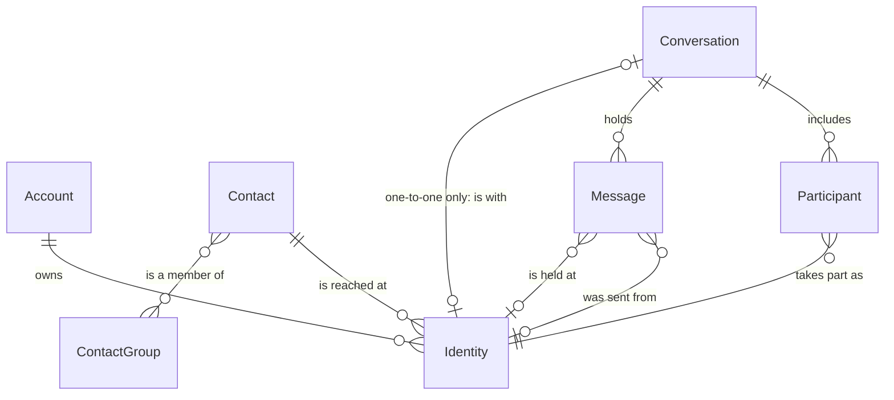
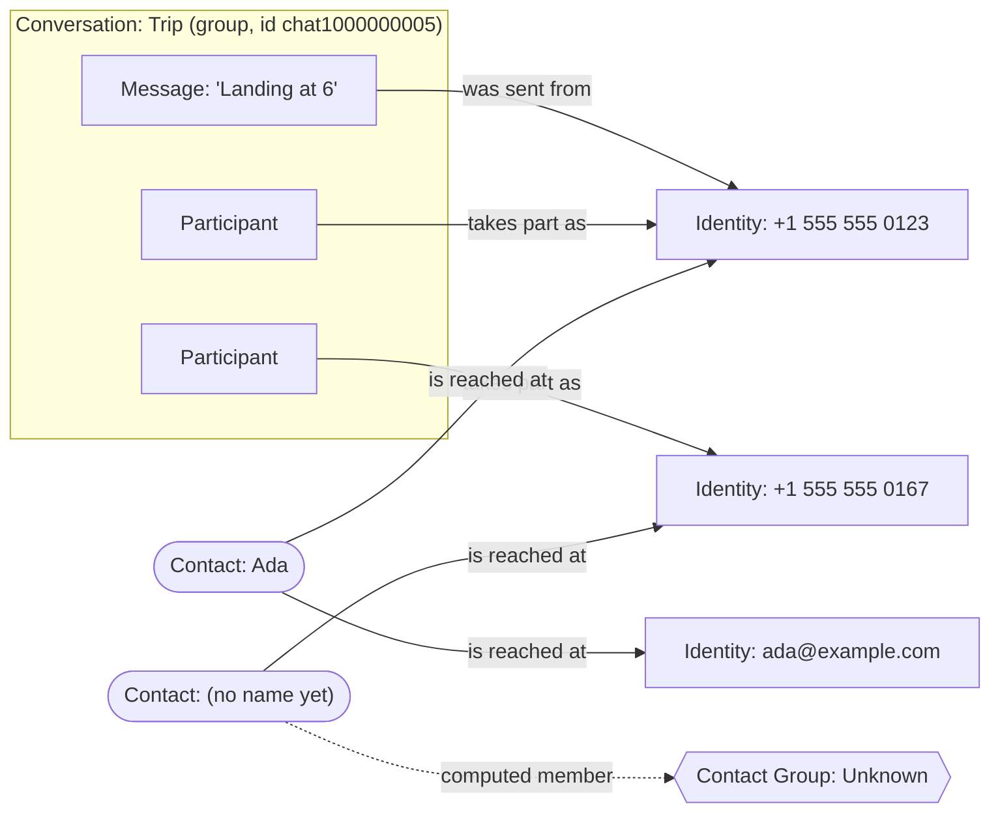

# Contacts, identities and messages

The people model: who Message Crate knows, how they are reached, and how
conversations and messages attach to them.

[How contacts are made and changed](how-contacts-are-made-and-changed.md)
follows an import and an address book load step by step, with a diagram for
each decision.

## Two words for one thing

An **identity** is one address a person is reached at: a phone number, an
email address, or a username on a service. The app and the published
documentation, the HTTP API and the conversation file say identity. The
database and the server code over it say **handle** (`handles`,
`contact_handles`). They are the same thing. This document says
identity and gives the code name where it helps.

## The relationships

Each line reads left to right. A bar means exactly one, a circle means none is
allowed, and a crow's foot means many.

| Relationship | What it means |
|---|---|
| Account owns Identity | An account's identity is one of the account holder's own addresses: the messages from it belong to the holder (`account_handles`). This is ownership, where a contact's identity is participation; the rule below says how Import applies it. `account_handles` is the one store of an account's phone numbers and email addresses: the profile's `emails` and `phones` read it, and `phones` holds each number once with every service it is an identity under, and two accounts can each hold the same address, as two people can share a family email. |
| Contact is reached at Identity | A contact is one person and gathers any number of identities under one name. An identity belongs to at most one contact (`contact_handles`, keyed on the handle). |
| Conversation includes Participant | A participant is one other person's seat in one conversation, and keeps what that backup called them there (`participants.name_alias`). The account holder is never a participant; the rule below says why. |
| Participant takes part as Identity | Every participant has exactly one identity: the address the person used, or, when the source named the person and recorded no address, an identity of type `other` holding the name. The participant's contact is the one its identity is on. |
| Conversation holds Message | A message lives in exactly one conversation. |
| Message is held at Identity | The account holder's own address on this message: the one it was sent from, or the one it was received at (`messages.owner_handle_id`). Set from the backup, sent or received. Empty when the backup names no owner. The identity need not be one of the account's. |
| Message was sent from Identity | Set for a received message. Empty for a message the account owner sent, and for one whose source recorded no sender (`messages.sender_handle_id`). A message never points at a contact; it reaches one through its sender's identity. |
| Conversation is with Identity | Only a one-to-one conversation is with an identity, and an identity has at most one such conversation. A group is with nobody; its people are its participants. |
| Contact is a member of Contact Group | Many to many. Unknown is a Contact Group the server computes; nothing is added to it by hand. |

## Rules

**An identity is always on a contact, and every participant and every sender
of a message is a contact.** An import makes a contact for every person it
meets: an unmatched phone number becomes a contact with that identity and no
name. A message's sender counts as met even when no conversation header names
them, as in a group header that leaves someone out. An
identity can move to another contact, move to a new contact, or be deleted,
and `contacts::move_identity` is the only way it leaves a contact. An identity
a conversation or a message uses is never deleted and never left on no
contact: when it comes off its contact, or its contact is deleted, it goes to
a new contact with no name, so the person is Unknown again. Only an identity
nothing uses is deleted outright, and no message goes with it. The account
holder's own identities are the exception: they are on no contact (see "The
account holder is never a participant"). Why: an identity on no contact
appears in no list in the product, so it could never be found, named, or
merged; and a participant that reaches its contact two ways, through an
identity or through a link of its own, gave each reader a second case to get
wrong (#1105). Junk contacts cost one delete.

**A person the source names with no address is an identity of type `other`
holding the name.** There is one for each service: the name in text messages
and the name on WhatsApp are two identities, which join one contact as the
same number on two services does. Two people one service names alike, with no
address for either, share the identity. Every participant then has an
identity, and `participants.handle_id` is required. An identity of type
`other` is a sign that the import was incomplete: an exporter that produces
one has a gap, and each Import Run counts the ones it met
(`other_identities`). Why: a person keyed by their contact made a second
contact and a second seat each time the contact was renamed, and counted in
none of their groups (#1105). Rejected: a value scoped to one conversation,
which could not be read, typed or loaded back from the address book.

**A contact missing a name or an address is Unknown.** An identity of type
`other` is no address, so a contact whose only identities are of that type is
Unknown however it is named. Unknown is computed
from the contacts, so it empties as people are named. It uses the ordinary
contacts screen; there is no separate review queue. Unknown counts as a
group: the contact shows it among its Contact Groups, and an Unknown contact
is not in "No group". Why: a contact listed under Unknown whose own groups
read "No groups" says two things at once.

**A contact with no preferred name goes by its first identity, in italics.**
The server sends the name empty rather than a placeholder such as `(unknown)`,
and sends `unknown` beside it, computed by the one rule above. The screen
shows the identity where the name would be. Why: a list of rows that all read
`(unknown)` cannot be told apart, and the italics keep an address from reading
as a name someone gave the contact.

**A group conversation is not a person.** A source gives a group an id of its
own, such as `chat1000000005`. The server stores it as the conversation's chat
handle (`conversations.chat_handle_id`) so the same group is recognised on
the next import. It gets no contact and is nobody's identity. The same holds
for the key of a conversation of orphaned messages (below). Only a one-to-one
conversation's chat handle is a person's address, and only that one gets a
contact. Import decides it by the conversation's type, never by the name of
the file it came in, so the desktop app's import path and the HTTP one, where
every file is `_import.jsonl`, agree
([#1169](https://github.com/messagecrate/message-crate/issues/1169)). Why: the id reaches
nobody, and a contact made from it shows up in Contacts as a nameless person
who never existed.

**A conversation keyed by a name, or by nobody, is not a person's address
either.** A source can name a person and record no address for them. Its
conversation's chat handle is then `name:` and the name, and the conversation
of rows that name nobody is `nameless:`. Neither gets a contact. The person a
name-keyed conversation is with gets their contact from their participant
record, an identity of type `other` holding the name. Why: the prefix keeps
the conversation apart from any other, so a person named "AMAZON" is not the
sender `AMAZON`, and a contact for the key as well as for the name made one
person two contacts
([#1541](https://github.com/messagecrate/message-crate/issues/1541)).

**A chat handle's type comes from the header, not its shape.** A group's chat
handle is stored with the type `other`, whatever it looks like. A one-to-one
chat handle takes the type the participant with the same address has, and so
does a message sender that is a participant. The service and the shape decide
only when no participant has it (below). Why: the exporter knows what its
source's ids are, and the address alone does not. A WhatsApp group id
(`120363042@g.us`) and an internal WhatsApp id (`123456@lid`) both hold an
`@`, and typed by shape alone each was stored as an email identity that
reaches nobody
([#1141](https://github.com/messagecrate/message-crate/issues/1141)).

**An identity's type is decided by its service first and its shape second.**
Each service says which types it can carry, and within those the shape
(`phone::Handle::parse`) picks one. WhatsApp carries phone numbers and its own
internal ids (`…@lid`, `…@g.us`, `…@s.whatsapp.net`), which are `other`. The
`phone` service carries phone numbers and email addresses, because iMessage
reaches an email address. A shape the service cannot carry is never that
type: an address with an `@` on WhatsApp is not an email address, however it
looks, and an import stores it as `other`. An import applies the rule to every
address it meets: a chat handle, a participant, a sender, a reaction's sender
and the holder's own address (`db/handles.rs`, `handle_type_on`). A type the
file states is held to it too. Why: the service knows what it can carry, and
the address alone does not. Typed by shape alone, a WhatsApp participant the
file left untyped, such as `123456789012345@lid`, was stored as an email
identity on WhatsApp, which no WhatsApp identity can be, and the identities
list named it `email`
([#1671](https://github.com/messagecrate/message-crate/issues/1671)).

**Text Message is one service, and a message's transport never changes an
identity's type.** SMS, MMS, RCS and iMessage are transports. Each message
records the one that carried it in `messages.service` as `sms`, `rcs` or
`imessage`, and an MMS is recorded as `sms` with the message kind `mms`. The
transport says how that one message travelled, not what its address is. So
when the source states no type, an address with an `@` is an `email` identity
on Text Message whatever transport carried it. An email-to-text gateway such
as `alerts@example.com` that writes over SMS is one `email` row on `phone`,
on one contact. A type the source states stands on Text Message, as above;
whether the file's type is needed at all is
[#1933](https://github.com/messagecrate/message-crate/issues/1933).
WhatsApp is the other way, as above: its `@` ids are `other`. Why: one
conversation holds both transports, and identities of one address are linked
only when their types are equal. Typed by transport, an address became
`email` from a header or an iMessage and `other` from an SMS message. That
made two identities on two contacts, and the second contact had no name. The
first contact's counts left the SMS messages out
([#1958](https://github.com/messagecrate/message-crate/issues/1958)).

**A phone number's type never depends on the message's service.** The service
only takes away a type it cannot carry, the email address; it never makes a
phone number anything else. A phone number is a phone number on any service,
including one the model does not know, and a sender the header does not list
over such a service is typed by its shape. Why: identities of one address are
linked as siblings only when their types are equal. A number typed `other`
because its message came over an unknown service, such as Apple Messages by
satellite, became a second identity on a new contact with no name, and the
real contact's counts left the message out
([#1144](https://github.com/messagecrate/message-crate/issues/1144)).

**One number is one person on every service.** iMessage, SMS, MMS and RCS are
all text messages, so a phone number that arrives over any of them is one
`handles` row with the service `phone`. The same number on WhatsApp is a
second row with the service `whatsapp`. When one of the two is on a contact,
the other joins the same contact (`contact_id_of_sibling_handle`). Why: the
rows differ only by service, and splitting them would show one person twice.

An import keeps the rule. An address book load is the exception: it moves,
adds and takes off only the identities its rows list, so a row for one of the
two leaves the other where it is, and a file that lists the two under
different contacts splits the number. Why: a load applies exactly what the
file says and never second-guesses it (below). The file is the person's
instruction, and a load that moved an identity no row lists would undo a
split the person made on purpose. Rejected: moving the other one with the
listed one (#1640, reversed in #1059).

The contact drawer moves only the identity it is given too, and can split a
number. Why: the person named that one identity, and the drawer has no way
to ask about the other.

**A phone number has one key everywhere.** `phone::key_typed_handle` gives a
number its key, and the same key is used by the `handles` row, by the entry
the contacts book files it under, and by the owner's own numbers
(`OwnerHandleSet`). A number with a `+` before its first digit keeps its
country: `+65 5555 0100` is `+6555550100`, and `(+44) 7700 900123` and
`tel:+447700900123` are `+447700900123`. A number without `+` is read in the
country stated for it, by the rules below, and keeps its digits as written
when none is: `020 7946 0000` is `02079460000`, never the invented
`+02079460000`, and `(555) 555-0100` is `5555550100`, never a US number by
default. Why: a book or owner key that differs from the handle key names
nobody, or names the wrong person. Stripping the `+` first once filed
`+65 5555 0100` under the US number `+16555550100`.

**A phone number carries its country as a fact.** The country lives inside
the key: a `handles` row whose `normalized` starts with `+` names its calling
code, and one without names no country. The key starts with `+` when the
country is certain: the number was written with its `+`, or written without
it in a country a source or a person stated (below). Matching is on the key
alone, so a number whose country is known matches only its `+` form, and one
whose country is unknown matches only the same digits. There is no column for
the country beside the key, because it would only repeat what the `+` says.
The country is the calling code rather than an ISO country, because a `+`
names only the calling code, which the countries that share a numbering plan
share (`+1` is the United States, Canada and much of the Caribbean). Why: a
single string could not say "national number, country unknown", and that
silence was the bug. A UK archive's `07700900123` and
`+447700900123` were two keys for one person, read as a US number or as
nothing, so their one-to-one conversation split in two and SMS Backup+
counted a group member with one number under
`group_members_with_several_numbers`
([#1676](https://github.com/messagecrate/message-crate/issues/1676)).

**An unknown country is stored as unknown.** A number written without `+`, in
no country anyone stated, is stored as the digits typed, with no `+`. It is
never matched to a `+` number until its country is known. When a person picks
its country, the row is rewritten in its `+` form and merges with any identity
already in that form (below). Why: nothing is guessed into the database as a
fact. The split remains only for numbers whose country nobody has stated, and
the person can see which those are (below). A short code (fewer than 7 digits
after the trunk prefix, `phone::MIN_NATIONAL_DIGITS`) has no `+` form in any
country, so it keeps its digits whatever country is stated.

A run's country rewrites only that run's numbers. A later run that states the
country keys its own `07700 900123` as `+447700900123`, and an identity an
earlier run stored as `07700900123` stays as it is, beside it, until the
person picks its country. Why: a merge moves conversations and messages and
cannot be undone, so it is asked about first (below), and an import has no
one to ask. The earlier run may also have been from a phone in another
country: the same digits are another number there. The bare identity shows
"Country unknown", so the person can see it and join the two.

**A country comes from three explicit sources and nothing else.** The archive,
when the source names the phone's country. SMS Backup+ does not. Apple's
`chat.db` does, in the `country` column of its `handle` table (`us`, `gb`),
but Message Crate does not read it yet: `imessage-database` 4.2.0's `Handle`
does not load the column, so the Apple Messages Reader cannot pass it on, and
the conversation file has no field for it
([#1994](https://github.com/messagecrate/message-crate/issues/1994)). The
import form's country for the run, which applies to every number written
without `+` in that run: the Import Run records it (`imports.phone_country`,
an ISO code), staging keys every such number in it, and SMS Backup+ keys its
own numbers in it too, because it decides which spellings are one group
member before the server sees the files (`Owner::in_country`). And a country
a person picks for one identity on the Contacts screen or My Identities.
There is no default taken from the account holder's own identities, and
nothing is inferred from the digits. Why: each of these is a statement by the
source or the person. A default from the holder's own numbers was considered
and parked, because it is a guess the design would later have to undo: a
holder with a `+1` number still texts people abroad.

A national number is read in a country by that country's trunk prefix: the
prefix is dropped and the calling code put in front (`07700 900123` in the
United Kingdom is `+447700900123`, `8 912 345 6789` in Russia is
`+79123456789`). A country whose leading `0` belongs to the number, such as
Italy, drops nothing. A number that starts with the country's own
international prefix is the calling code and number that follow it: `00` in
the United Kingdom (`0044 7700 900123` is `+447700900123`), `011` in a `+1`
country, `0011` in Australia, `810` in Russia, `010` in Japan. Digits after
the prefix that start with no calling code are refused and keep their digits.
A number that starts with the country's own calling code was written in full
without its `+` when the trunk prefix is kept after the code (`44 (0)7700
900123`), or when what follows the code is as long as the country's fixed-line
and mobile numbers are and the digits as a whole are not (`447700900123` in
the United Kingdom, `79161234567` in Russia). When only the whole is as long
as a number there, it is a national number that starts with the same digits:
`55 99123 4567` in Brazil has the area code 55, and `9112345678` is an Indian
mobile number. When both are, as `49 151 23456789` is in Germany, the number
is refused rather than guessed: it keeps its digits, counts under
`phones_needing_review`, and its review note reads `4915123456789 could be
+494915123456789 or +4915123456789; pick its country or write it with +`. Why:
reading `00` and the trunk prefix the same way in every country gave
`00447700900123` the key `+440447700900123`, `447700900123` the key
`+44447700900123` and Australia's `0011 44 …` the key `+1144…`: keys that look
certain and name nobody. The countries, their calling codes, trunk prefixes,
international prefixes and number lengths are one table, `phone::COUNTRIES`,
taken from libphonenumber's `PhoneNumberMetadata.xml` (its doc comment names
the commit), which `GET /v1/phone-countries` lists for the import form and the
country picker.

**The screens say when a number's country is unknown and let the person fix
it.** An identity's `country_unknown` is true for a phone number whose key has
no `+` and is long enough to have a `+` form. The Contacts screen and My
Identities show such a number as the digits typed with a "Country unknown"
note and a Pick country control. Picking a country sends
`set_identity_country` in `PATCH /v1/contacts/{id}` or
`PATCH /v1/accounts/{id}`. When no identity on the same service holds the
`+` form, the row is rewritten in place. When one does, the request answers
`409 Conflict` (`identity-exists`) naming who holds it, a contact, the
account or nobody, in `detail` and in `holder`, and the screen asks before it
sends the request again with `merge` (`http-api.md`, "Status codes"). A
merge moves everything that names the national number to the identity
holding the `+` form: participants (a group that lists both keeps one seat),
senders and owners of messages and reactions, the account's own identity
link, and the one-to-one conversation, whose messages, participants and
Message Tags join the other one-to-one conversation when there is one
(`db/identity_country.rs`). The merged conversation is in the Trash only
when both were: a live one brings the other out of the Trash with it, and the
trashed one's messages are shown again. The merged identity goes on the
contact whose screen picked the country, from whatever contact held the `+`
form, and a contact with no name left with no identity goes; from My
Identities it stays where it was and becomes one of the account's own, and the
with-yourself rule runs again around the merge (#1662). Every message of a
conversation the number is the chat handle of, a member of, or a sender in
has its content key made again and its duplicate flag worked out again
(`dedupe_changed_messages`), whether the row was rewritten in place or merged,
because a content key is made from the chat handle's, the sender's and a
group's members' keys. A merge does the same for the identity holding the
`+` form, whose keys change when the merge makes it one of the account's
own: its one-to-one becomes a conversation with yourself, and a group leaves
it out of its key. Why: an identity has at most one one-to-one
conversation, so two identities that become one bring their conversations
together, and a merge cannot be undone, so the person is asked first. A
trashed conversation does not take a live one into the Trash, because
emptying the Trash would delete the live messages for good. Rejected:
leaving the merged identity on another named contact that held the `+` form,
which left the contact on screen with no identity; and refusing the merge
there. The person picking the country is the one who knows the two are one
number, and the question names the other contact.

A number on a contact whose `+` form is one of the account's own identities
is not joined from the Contacts screen: `PATCH /v1/contacts/{id}` answers
`409 Conflict` (`state-conflict`), naming My Identities. There, the person
adds the number to the account's identities and picks its country, and the
two join as the account's own. Why: joining it makes the number's
conversations ones with yourself and takes the number off the contact, which
is an act on the account's identities, and a contact's screen that ended with
its only identity gone would have nothing left to show.

**Existing rows are not touched.** A key takes its `+` when a row is written,
from the number's own `+` or a stated country, and no pass rewrites the rows
already written. A schema change rebuilds the database (CLAUDE.md, "No
backwards compatibility"), so a database from before a country could be
stated starts empty.
Why: a back-fill would need a default country, which is the guess the rules
above refuse.

**An address is classified once, from the value the backup wrote.**
`phone::Handle::parse` decides what an address looks like before anything
else touches it: one with `@` is shaped as an email address, one written as a
number is a phone number keyed as above, and anything else, such as `AMAZON`,
is a sender name and becomes an identity of type `other`. The service then
keeps the shape's type or, for an `@` address it cannot carry, makes it
`other` (above). The SMS exporters carry the `Handle` from there to the
sender, the participants and the owner.
Why: the SMS exporters once stripped every address to its digits first, so
`john1985@example.com` became the phone identity `1985` and a message from
`AMAZON` was dropped.

**The server reads an address's shape by `phone::Handle::parse` alone.** A
chat handle, a participant or a sender whose source gave no type, an owner
address, an identifier checked before an import, an identity a person adds
or swaps in on a contact, and one an account adds to its own profile all take
their shape from it, and no second rule reads the characters. An import then
holds the shape to its service (above). A contact edit and the account's
profile refuse an email address on WhatsApp instead (below). A contact edit
that names an address the account already holds on that service takes that
row as it is, so a WhatsApp internal id the import stored as `other` stays
`other`.
Why: identities of one address are linked only when their types are equal.
A second rule that read characters typed `tel:+15555550157` as `other` and
the same number as a sender as `phone`, and one that read the service typed
`ada@example.com` added under iMessage as a phone number
([#1432](https://github.com/messagecrate/message-crate/issues/1432)).

**A request names a service as `phone` or `whatsapp`, and nothing else.** A
contact edit and an account's own identities take those two words and refuse
any other, naming the two. An email address is on `phone`, where iMessage
reaches it.
Why: every other word was read as `phone`, so a misspelt `whatsap` put an
identity on Text Message without a word
([#1630](https://github.com/messagecrate/message-crate/issues/1630)), and
once the address decided the type, `email` was only a second name for `phone`
([#1631](https://github.com/messagecrate/message-crate/issues/1631)).

**Swapping a contact's identity finds the old one on its own service.** The
edit names the old address and the new one, and may name a service for the
new one. The old identity is the one on the named service when the address
is on the contact under more than one, and otherwise the one it has, so one
edit moves a contact from WhatsApp to Text Message. With no service named,
the new identity stays on the old one's service, and an address that service
cannot carry, an email address on WhatsApp, is refused with the reason.
Why: looked up on the named service, a WhatsApp identity was never found for
a Text Message edit, and an email address swapped in with no service became
an email identity on WhatsApp
([#1411](https://github.com/messagecrate/message-crate/issues/1411)). The
edit refuses rather than moving the identity to the phone service, because
the person did not ask for a service change.

**An import names only a nameless contact.** When the backup knows a name and
the contact has none, the import sets it, whatever made the contact: an
earlier import, an address book load, or the person. A name a person types
or loads from an address book replaces an imported one. A later backup with a
different spelling does not. Why: a blank name has nothing to protect, and a
nameless contact a load or the person made would otherwise stay Unknown
though the backup knows who it is. Rejected: naming only a contact an import
made, a condition from before the address book load existed, when an
import's contact was the only nameless kind (#1058). See
[ADR 0006](../adr/0006-an-import-names-the-contact.md).

**The address book is a file for editing contacts, not a source of them.**
Contacts and identities arrive with message imports; the address book is
how a person takes what the account holds out to a spreadsheet, corrects it,
and puts it back. The file is Message Crate's own CSV, one row per identity:
`contact_id, display_name, groups, service, identity_type, identity`. Export
fills `contact_id` from `contacts.id`; on load, rows that share an id are one
contact, a blank id makes a new contact, and any other text groups new rows
under a key of the person's choosing. `display_name` and `groups` (Contact
Group names, separated by `;`) describe the contact, so they repeat on each
of its rows and must agree or be blank; two rows of one contact that disagree
refuse the load. `service` and `identity_type` take the values the `handles`
table stores. Why: an address book from a phone puts every number and email
on the card into the database as a text-message identity whether or not a
message ever used it, cannot say which service an address belongs to, and
carries numbers formatted every way at once. A file Message Crate writes itself
has none of those problems, and a spreadsheet is the right tool for naming
fifty Unknowns at once. Rejected: reading vCard or a vendor's CSV directly.
A conversion from vCard to this file, for editing before a load, is
separate work.

**A load is Append or Edit, and touches only the contacts in the file.**
Append creates the contacts the file names, renames the ones it holds,
and adds the identities and Contact Group memberships it lists; it removes
nothing. Edit does the same and then makes each contact in the file hold
exactly the identities and memberships its rows list, so a row taken out of
the file takes that identity off the contact: the identity stays in its
conversations and the person is Unknown for it again, as after a contact
delete. A contact absent from the file is left alone in both modes, and no
mode deletes a contact, except one left with neither a name nor an identity,
which nothing could ever reach. A loaded name replaces the name the contact
carried, an imported one and a typed one alike, because a load applies
exactly what the file says (below) and the file is the person typing; a
blank name says nothing and leaves the name alone. Rejected: protecting a
typed name from a load (#1057). An exported file carries the typed name, so
a load straight back changes nothing either way, and a different name in the
file is the person saying so. A
group name that matches no Contact Group creates one. Why: the export can be
a subset (a search, the checked rows), so a file that spoke for the whole
account would delete everyone it did not mention, and a file that could only
add would leave a wrongly linked address unfixable from the sheet.

**A load applies exactly what the file says, and never second-guesses it.**
A load carries out what the rows state: the contacts they name, the names
they give, and the identities and Contact Group memberships they list, and
in Edit it takes off what a listed contact's rows leave out. It never
corrects, infers or protects anything the file does not say to make the
result closer to what the person may have meant, even when the file looks
like a mistake. The consequences the rules below spell out are not
corrections: a nameless contact a load empties is deleted; when Edit takes
off an identity that a conversation, message or reaction still uses, the
identity goes to a new contact with no name; and a phone number is read
with its `+` back when the spreadsheet dropped it without showing, which
the load's notes say. Where a rule elsewhere in this
document does more for an import, such as "one number is one person on
every service", a load does only what its rows say. Why: the person edited
the file to say what they want, and a load that second-guessed it would
change things no row shows, which the person can neither see in the sheet
nor undo from it. A row the load cannot carry out refuses the load (below)
rather than being guessed at.

**A load is strict, and refuses whole.** A phone is keyed by the one rule
above, an email is lowercased and must be one `@` with text on both sides,
an unknown `service` or `identity_type` is an error, and so is a row with more
fields than the header, whose cells cannot be matched to the columns. A row
with fewer fields reads its missing trailing cells as blank, because a
spreadsheet can drop empty cells at the end of a row and no column moves.
Any bad row refuses the whole load, naming each row and its reason, and
nothing is stored as "needs a look". Why: the file is edited before it is loaded, so a refused row
is a fix made in the sheet in seconds, while a stored bad key is a contact
that matches no message and has to be found later. A partial load would leave
the person unsure which rows went in, and a load is cheap to repeat.

**A phone number without `+` names the `+` identity its own contact holds.**
When a phone value written without `+` matches no key as written, and `+`
followed by its digits is the key of an identity the row's contact already
holds, the row names that identity. A contact that holds both readings
(`+6555550100` and `6555550100`) refuses the load, naming both keys.
Otherwise the value is keyed by the phone rule above. The load's `notes` name
each row read with its `+` back, and each value without `+` that became a new
identity. Export writes the number as `'+6555550100`, so a spreadsheet that
opens the file keeps the `+`, and the load takes the `'` off again
([A cell a spreadsheet would run](how-contacts-are-made-and-changed.md#a-cell-a-spreadsheet-would-run)).
This rule covers a file a spreadsheet saved some other way, without the
`'`. Why: a spreadsheet can save `+6555550100` as the number `6555550100`
without showing it, and keying that value as written made a new identity,
which Edit then put on the contact in place of the real one (#1196). Only
the row's own contact is looked at, so a dropped `+` never attaches another
person's number to this contact. The notes exist because the person cannot
see the `+` go, so a wrong reading has to be shown before it matters.

**An identity moves only from a contact the load may change.** When a row
puts an identity on one contact and the database has it on another, it moves to
the file's contact if the current holder is nameless (an Unknown, whatever
made it) or is itself in the file. Taking an identity from a named contact the
file does not mention refuses the load, naming the row, the identity and
both contacts. The same identity under two ids in one file refuses the load
too. Why: naming the Unknowns is the job the file exists for, so that move
must be free; a silent move off a named person is the one outcome the person
cannot see happen, and asking for both contacts in the file makes it
deliberate. Rejected: refusing whenever the holder has other identities. An
Unknown holder can have two handles for one number (text messages and
WhatsApp), and that rule would refuse the commonest cleanup.

**Export writes the current Contacts list; load lives under Settings.** The
export is on the Contacts screen and writes the rows the person is looking
at: the search words and the checked contacts pick what goes in the file, and
an empty search is everything, nameless contacts included. The load answers
how many contacts it created, updated and deleted, how many identities it
added, moved and removed, and how many groups it created, and it lists the
phone numbers without `+` it read as the rule above says. Why: the job is
nearly always "the Unknown ones", "this group" or "these ten", which the
Contacts screen already expresses and a Settings button cannot. A durable
record of each load, in the Settings table beside message imports, is
deferred, not rejected.

**A person has one seat in a conversation.** A participant is keyed on the
conversation and its identity (`UNIQUE (conversation_id, handle_id)` on
`participants`), and an import that meets an existing seat leaves it as it
is. A participant has no contact column: it reaches its contact through its
identity in `contact_handles`, so a renamed contact or a moved identity
reaches every conversation at once. Why: a key that includes an empty column
matches nothing, so re-importing the same backup added the same person again,
and a contact column written once at import went stale when the identity
moved, so search found the conversation under the old contact.

**Two copies of one conversation take the later copy's title.** Two
conversations on one chat handle are one conversation
(`UNIQUE (account_id, chat_handle_id)` on `conversations`), so a second backup
of a group, or one chat id written two ways, merges into the conversation
already there. The merged conversation keeps the group title of the copy whose
latest message is later. A copy with no title never clears a title, and when
both copies' latest messages share one time, the title already stored stays.
Times are compared to the millisecond, the precision a message's time is stored at.
The conversation stores the latest message time of the copy that gave its
title (`group_title_at`), and an incoming copy is compared with that, not with
the whole conversation: an untitled copy whose messages end last would
otherwise keep an older title against a newer one. A title of only spaces counts
as no title. The rule is the same in one batch as across several, in any order.
Why: a group is renamed over time, so the copy whose messages run later carries
the name the group has now. An old backup uploaded after a newer one can't bring the old
name back, because its messages stop earlier. The backup date a conversation
file carries (`export.backup_taken_at_unix_ms`) is missing where a source records
none, and for several sources is a file's modification time, which copying the
file can change; the time an exporter ran says nothing about the backup; so
neither decides the title
([#1408](https://github.com/messagecrate/message-crate/issues/1408)).

**Between two copies of one message from one source, the copy from the later
backup decides its mark and text.** One message from one source is one row
(`UNIQUE (account_id, source, guid)` on `messages`, and the same on
`staging_messages`), so a second backup of the same phone meets the copy
already there, in the same import or a later one. The conversation file says
when its backup was made (`export.backup_taken_at_unix_ms`), staging keeps
that date on each staged row, and `messages.backup_taken_at` keeps the date of
the backup that decided the stored copy. When both copies have a date, the
copy from the later backup gives the message its deletion mark, mark or no
mark, and its text and earlier versions, whatever the versions' times say; a
copy from an earlier backup changes neither. The duplicate flag follows the
text, because the dedupe compares the text. The date is kept to the
millisecond, the form every stored time takes. When either copy has no date,
or the two dates are equal, nothing says which backup is newer, so the rules
for files without one hold: a copy with a mark adds it and one without leaves
the mark held, and a copy takes the text when its newest earlier version is
newer
(`later_edit_sql` in `db/staging.rs`). Attachments and reactions add from
either copy, because a backup that lacks one does not say it is gone. The
rule is the same in one import as across several, in any file order
(`later_backup_sql` in `db/staging.rs`, `add_staged_copy` in
`imports_api/staging.rs`). Why: a person recovers a deleted message and
unsends or edits a sent one between two backups, and only the backup's own
date says which state is the newer; the message's own times record when it
was written, not when a part was unsent, so they cannot tell
([#1741](https://github.com/messagecrate/message-crate/issues/1741),
[#1804](https://github.com/messagecrate/message-crate/issues/1804),
[#1924](https://github.com/messagecrate/message-crate/issues/1924)).

**An import that changes a stored message's content puts its duplicate flag
right, whatever the import's dedupe setting.** A later edit changes a stored
message's text, and an attachment added or given its file changes what its
content key hashes, so its duplicate flag can stop matching. The import runs
the dedupe for those messages inside the import's own write transaction, and
writes the flags of the messages tied to them: those a changed message hid or
was hidden behind, before or now, followed to the end
(`dedupe_changed_messages` in `dedupe.rs`). An import with dedupe on leaves
this to the full dedupe that follows it. The pass compares only messages with
a content key, the ones a dedupe has seen, and takes up a changed message only
when it had one, so a message an import with dedupe off brought stays as it
came, even when a later import changes it. Why: the dedupe
setting governs the rows an import brings, and a flag the import itself made
wrong would hide a message behind a copy whose text no longer matches, where
no search finds it
([#1805](https://github.com/messagecrate/message-crate/issues/1805)).

**Within one source, a whole-second message is the duplicate of its
millisecond twin.** Each message says whether its source recorded its time to
the millisecond or in whole seconds (`time_precision` in the conversation
file, `messages.time_precision`). The dedupe hides a whole-second message as
the duplicate of a message from the same source that matches it in everything
else and has milliseconds in the same second, so the message is shown once. It
is shown with its milliseconds unless another source holds it too and that
source's copy wins the cross-source comparison (`pick_winner`, which ranks by
attachments and then import order, not precision). The content key stays at
whole seconds, so the two share a key, and the exact pass sets the
whole-second copy aside before it compares sources (`content_key_group_flags`
in `dedupe.rs`). A source that holds a message only in whole seconds, or only
with milliseconds, keeps every copy, as before. The flag decides, never the
time: a millisecond time that ends in `.000` is not a whole second. A
whole-second copy and a millisecond copy whose time ends in `.000` have one
guid, so they are one stored message, and it says `milliseconds` whichever
copy came first, in one import or across several (`promote_time_precision` and
`add_staged_copy_milliseconds` in `db/staging.rs`). Why: one source can record
one message twice, once without its milliseconds (an SMS Backup+ mail timed by
its `Date` header beside one timed by `X-smssync-date`), and the two copies
have different guids, which are made at milliseconds, so both reach the
database; without the flag, a copy that landed on `.000` could not be told
from a copy that never had milliseconds
([#1096](https://github.com/messagecrate/message-crate/issues/1096),
[#1923](https://github.com/messagecrate/message-crate/issues/1923)).

**A participant's display name has one rule.** The contact's name, else what
that backup called them in that conversation, else the identity. One loader
applies it for the conversation list, the message pane, and Export.
A contact in the trash counts as no contact here: the participant takes the
backup's name, else the identity, and carries no contact id.
Why: the contact cannot be opened while it is in the trash, so a link to it
would lead to `404 Not Found`.

**Deleting a contact keeps its conversations.** The name and details go. The
identities stay in their conversations and the person becomes Unknown again.

**The account holder is never a participant.** An account is always read from
the account holder's side: every conversation in an account is the holder's
own, so the server knows they are in it without listing them. Participants are
the other people. Which of the holder's identities a message used is recorded
on the message itself, as the identity it is held at, taken from the message
when the backup records it per message (iMessage) and from the backup's header
when the backup has one owner. See
[ADR 0015](../adr/0015-the-owner-is-recorded-on-the-message.md). Why: a
participant row for the holder would need a contact, a name, and a place in
every participant count and conversation title, and each reader would then have
to leave it out again.

**An import drops a participant that is the account holder.** A backup can
list the holder's own address among a group's members. The exporter leaves out
the addresses the backup names as the owner's, and the server leaves out any
participant whose address is one of the account's identities, for every source.
The server matches by normalized address and type, whatever service the
identity is linked under, so a Text Message identity also drops the number from
a WhatsApp group. It loads the identities once per run and makes no handle,
contact or participant row for a matching member (`imports_api/staging.rs`,
`insert_participant`), and no contact for a message or tapback sent from one
(`resolve_incoming_sender_handle`); an import never adds an identity. Why: the
exporter and the server know different addresses. The backup may list the
holder under an old number the exporter cannot know is theirs.

A group's dedupe key leaves the account's identities out too (`dedupe.rs`,
`ContentKeyInputs`, through `is_account_identity_sql`). Why: a group imported
before an identity was linked still lists the holder, and the same group
imported after does not; without this their messages would not pair.

**A conversation with yourself has no participants.** Notes the holder sends to
their own address are a conversation whose chat handle is one of the holder's
identities. It has no participants and makes no contact. Both rows of each note
are kept, the sent and the received, and the received row has no sender. Its
title is the account's display name, or the address when there is none,
computed when it is shown, even when the backup gave the chat a name. `with:me`
finds it. Why: the other person in it is the holder, and the holder is never a
participant. A contact for the holder would be a second record of the account.

Import decides it by the chat's own identity, against the identities it loads
once per run: a one-to-one chat whose identifier is one of them gets no contact
for that identifier, drops the senders of its received rows, and marks a
reaction in it as the holder's own (`imports_api/staging.rs`,
`FileStaging::stage`). The header's participant, if the source lists the holder
as one (WhatsApp's "Message yourself" does), is dropped as any account identity
is. A read asks the same question of the identities the account has now
(`db/conversations.rs`, `is_with_yourself_sql`): the conversation list and the
conversation page do not read its chat handle back as a participant
(`db/participant_names.rs`), and the title (`conversation_title_sql`) is the
one expression the conversation list, the conversation page, the Messages list,
`title:`, `in:` and plain text all read
([#1094](https://github.com/messagecrate/message-crate/issues/1094)).

Participants and the holder's contact follow the identity list. When an
account's identities change, the server runs the rule again over the
account's conversations, in the same transaction
(`imports_api/with_yourself.rs`). Messages are not rewritten. Why: otherwise
the title and `with:me`, which ask of the identities the account has now,
and the stored rows, which an import wrote against the identities it had
then, disagree, and the holder stays their own contact
([#1662](https://github.com/messagecrate/message-crate/issues/1662)).

A participant at one of the account's identities is set aside from every
conversation, one-to-one and group alike, as an import never writes one
(`db/participants.rs`). The row moves to `participants_set_aside` with the
name the backup gave. Other participants stay, because an import writes them
too.

The contact an import made for the holder is deleted only when nobody has
touched it. Its origin is `import`, it carries no name, and it is in neither
the Trash nor a Contact Group the person made. Nothing but the holder's own
rows refers to it either: a message or a reaction sent from one of the
account's identities does not count, because an import gives such a sender
no contact (`db/contacts.rs`, `delete_untouched_holder_contact`). Any other
holder contact stays. Why: an address book load renames a contact without
changing its origin, so a name cannot be told to be the backup's, and
deleting the contact would lose the name. The deleted contact's Import Run
records and its Import Run Contact Group memberships are set aside under each
identity it held.

Removing an identity gives back what linking it set aside. Each participant
set aside at it returns as it was, with its name. Each of its identities that
a conversation holds as a participant, a one-to-one chat handle or a received
row's sender gets a contact when it has none, as an import would make one.
That contact takes the Import Run records and Contact Group memberships set
aside for the identity. A conversation that is no longer with yourself also
gets its chat handle as a participant when it has none. Its name is the name
of the contact on the chat handle, when the contact has one. A conversation
imported while the chat handle was an identity has no participant row to give
back, so that name is the only one there is.

An import while the identity is linked writes no participant at it, so a
participant set aside comes back with the name it had when it was set aside,
even when a later backup named the holder differently. Why: the import drops
the holder's participant before it is written, so the newer name is never
stored. Importing that backup again after the unlink does not change it
either, because an import never replaces a participant row already there
(`db/staging.rs`, `promote_participants`).

Removing an identity also settles the Import Run records and Contact Group
memberships set aside for it. They go to the contact the identity has, or to
the one it gets. When it gets none, because no conversation holds it any
more, they are forgotten. Why: a record left behind would go to whichever
contact a later unlink made, under a run that never touched it.

Dedupe matches a received note in a conversation with yourself with no sender,
in the content key and in the near-time pass alike (`dedupe.rs`,
`sender_for_key_sql`, through `is_with_yourself_sql`). Why: a copy imported
before the chat's address was linked still names the holder as its sender, and
a copy imported after has none; without this the two copies would not pair, and
the note would show twice
([#1661](https://github.com/messagecrate/message-crate/issues/1661)).

**Orphaned messages sit in conversations of their own kind.** A backup can hold
a message without recording which conversation it was said in. An orphaned
message that names the other person sits in that person's orphaned
conversation, whichever way it went: one they sent names them as its sender,
and one the holder sent names them as its recipient. That person is the
conversation's only participant, and it stays apart from the one-to-one
conversation with them. It is titled with the contact's name and "Orphaned", as
"Ada · Orphaned". An orphaned message that names nobody sits in one
conversation with no participants, titled "Orphaned · Unknown person": one the
holder sent with no recipient recorded, and one received with no sender or with
one of the holder's own addresses as its sender. These conversations are
neither one-to-one nor a group, and `kind:orphaned` lists them, and
`kind:direct` and `kind:group` do not. An import tags none of them, as it tags
no conversation. Why: one conversation holding hundreds of people's messages
reads as an exchange that never happened, and putting them in the one-to-one
conversation would claim something the backup does not say
([#1095](https://github.com/messagecrate/message-crate/issues/1095)). Both
directions of one person's orphaned messages sit together because the backup
names that person on both, and a title of "Missing recipient" would be wrong
for a sent message whose recipient it records
([#1778](https://github.com/messagecrate/message-crate/issues/1778)).

Each is keyed `orphaned:` and the person's address, or `orphaned:` alone for
the one that names nobody (`message_ir::orphaned_chat_id`), so it never takes
the key of the person's one-to-one conversation, and its type is `orphaned`.
The key is the conversation's own and nobody's address: it gets no contact,
and search reads it as no text, as it does a group's id. Every title says
"Orphaned", so the word `orphaned` finds every one of these conversations by
its title, while `"orphaned:"` finds none. The title is computed on every read
(`db/conversations.rs`, `conversation_title_sql`) from the first participant's
name as the conversation shows it, so it follows a rename of the person's
contact. The Apple Messages Reader writes these conversations for messages in
no chat (`emit.rs`, `orphaned_conversation`). It reads the person from the
row's `handle_id` in both directions: a received row's sender, and a sent
row's recipient, which Apple records on a one-to-one chat's sent rows and
leaves 0 on a group's. OpenExtract writes the one that names nobody for a sent
row that names no recipient, and those rows carry a vendor key so that the
same text sent to several people in the same second stays several messages.

**An account's own identity means ownership, and its message counts describe the
messages it holds.** A contact's identity says the person took part; an
account's identity (`account_handles`) says the messages sent from or received
at that address are the account holder's own. Import is where that decision is
made: the reader takes the holder's addresses from the backup when the backup
names its owner, and from this list when it does not, and marks each message
sent or received accordingly. Linking or removing an identity afterwards changes
no message already imported. What the product shows beside an account's
identity, and repeats before it is removed, is the number of messages held at
that identity, split three ways by direct, group and orphaned conversation, and
the number of conversations holding at least one of them. Why: the count says
what the person did at that address, and one conversation that used two of the
holder's identities counts each message once, under the identity it used.
Rejected: counting messages the identity sent, because received messages are the
holder's too; and counting every message in a conversation the identity appears
in, because a conversation that used two identities would count all its messages
twice.

**A contact's identity counts the messages the contact sent from it.** Beside
each of a contact's identities the product shows the first and last message
sent from it, the number sent from it in direct, in group and in orphaned
conversations, and the number of conversations the identity takes part in,
whoever wrote in them. The selection summary for a contact counts the same way
across all its identities, and splits the contact's conversations the same
three ways. Why: every count or date of messages about a contact means the
messages the contact sent, the same messages `messages:` and the contact's
total count on Contacts read, so the identity table, the summary and a search
give one number for one person. Rejected: counting every message in the
conversations the identity takes part in, because that counts the holder's own
replies and every other member of a group as the contact's (#913).

**Every split of a person's conversations or messages by kind is three-way.**
A contact's conversations, the messages it sent, and the messages held at an
account's identity are each counted as direct, group and orphaned, and the
three figures add up to the total. The screens show the orphaned figure only
when it is not zero, so a person with no orphaned messages sees the two
figures shown before orphaned conversations existed. Why: a conversation of
orphaned messages is neither a one-to-one nor a group, so a two-way split
leaves its messages in neither figure and the figures stop adding up to the
total. Rejected: folding orphaned conversations into direct or group, because
that would say a sender's orphaned messages went to one recipient, or to a
group, when the backup no longer says which (#1782).

**An import never adds an account identity.** A backup that names an owner
address the account does not have records it on the messages and leaves the
account's identities as they are. Why: the person adds identities themselves,
and an address they have not added is one they chose not to claim; a backup's
owner field can also name something that is not a messaging address, such as
the mail account a backup was stored in. Because the address is already on the
messages, linking it later shows its counts without a re-import.

**An import replaces a trashed contact.** When an import meets an identity of
a trashed contact, it makes a new contact from the backup, as a first import
would, holding that identity and the same number on the other service, and
discards the trashed contact. Each other identity the trashed contact had
leaves it as the first rule says: to a new contact with no name when a
conversation or a message uses it. See
[ADR 0013](../adr/0013-an-import-replaces-a-trashed-contact.md). An import
never looks a contact up by name, so a trashed contact that shares a name
with someone the backup names is never matched.

**A failed import changes no contact.** Staging meets every identity first,
so it is where the import makes contacts and discards trashed ones. Staging
and promote run in one transaction, and a failure in either rolls both back.
Why: a trashed contact's name and Contact Groups are gone for good once
discarded, and a contact made for an import that brought no messages is
clutter the person never asked for.

## One group chat, drawn out

A group called Trip with two other people. Ada has a phone number and an
email address on one contact. The second person has no name yet, so the server
counts them in Unknown. The group's id stays on the conversation and touches
nothing else.

## Where it lives in the code

| Concern | Location |
|---|---|
| Tables for contacts, identities, Contact Groups, trash | `schema/sql/contacts.sql` |
| Tables for conversations, participants, messages | `schema/sql/messages.sql` |
| What an import creates for a conversation and its participants | `crates/server/server/src/imports_api/staging.rs` |
| Which type an identity takes on its service | `handle_type_on` in `crates/server/server/src/db/handles.rs` |
| A phone number's key and its country | `key_typed_handle` and `COUNTRIES` in `crates/libs/phone` |
| Picking a number's country, and merging it into the `+` form | `crates/server/server/src/identity_country.rs`, `crates/server/server/src/db/identity_country.rs` |
| Which title two copies of one conversation keep | `insert_conversation` and `upsert_conversations` in `crates/server/server/src/db/staging.rs` |
| Making, naming, and replacing a contact during import | `crates/server/server/src/imports_api/contact_name.rs` |
| Linking identities to contacts, sibling identities, the one way an identity leaves a contact (`move_identity`) | `crates/server/server/src/db/contacts.rs` |
| Writing and loading the address book | `crates/server/server/src/db/address_book.rs` |
| The display name rule | `crates/server/server/src/db/participant_names.rs` |
| Which conversations involve a contact | `involves_contact_expr` in `db/contacts/read.rs`, `conversation_involves` in `search/bridge.rs` |
