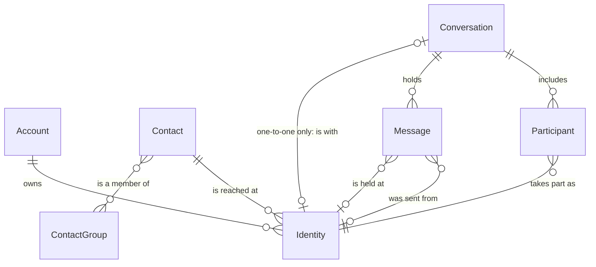

# Contacts, identities and messages

The people model: who Message Crate knows, how they are reached, and how
conversations and messages attach to them.

[How contacts are made and changed](how-contacts-are-made-and-changed.md)
follows an import and an address book load step by step, with a diagram for
each decision.

## Two words for one thing

An **identity** is one address a person is reached at: a phone number, an
email address, or a username on a service. The app and the published
documentation say identity. The code and the database say **handle**
(`handles`, `contact_handles`). They are the same thing. This document says
identity and gives the code name where it helps.

## The relationships

Each line reads left to right. A bar means exactly one, a circle means none is
allowed, and a crow's foot means many.

| Relationship | What it means |
|---|---|
| Account owns Identity | An account's identity is one of the account holder's own addresses: the messages from it belong to the holder (`account_handles`). This is ownership, where a contact's identity is participation; the rule below says how Import applies it. `account_handles` is the one store of an account's phone numbers and email addresses: the profile's `emails` and `phones` read it, and two accounts can each hold the same address, as two people can share a family email. |
| Contact is reached at Identity | A contact is one person and gathers any number of identities under one name. An identity belongs to at most one contact (`contact_handles`, keyed on the handle). |
| Conversation includes Participant | A participant is one other person's seat in one conversation, and keeps what that backup called them there (`participants.name_alias`). The account holder is never a participant; the rule below says why. |
| Participant takes part as Identity | Every participant has exactly one identity: the address the person used, or, when the source named the person and recorded no address, an identity of type `other` holding the name. The participant's contact is the one its identity is on. |
| Conversation holds Message | A message lives in exactly one conversation. |
| Message is held at Identity | The account holder's own address on this message: the one it was sent from, or the one it was received at (`messages.owner_handle_id`). Set from the backup, sent or received. Empty when the backup names no owner. The identity need not be one of the account's. |
| Message was sent from Identity | Set for a received message. Empty for a message the account owner sent, and for one whose source recorded no sender (`messages.sender_handle_id`). A message never points at a contact; it reaches one through its sender's identity. |
| Conversation is with Identity | Only a one-to-one conversation is with an identity, and an identity has at most one such conversation. A group is with nobody; its people are its participants. |
| Contact is a member of Contact Group | Many to many. Unknown is a Contact Group the server computes; nothing is added to it by hand. |

## Rules

**An identity is always on a contact, and every participant and every sender
of a message is a contact.** An import makes a contact for every person it
meets: an unmatched phone number becomes a contact with that identity and no
name. A message's sender counts as met even when no conversation header names
them, as in `orphaned.jsonl` or a group header that leaves someone out. An
identity can move to another contact, move to a new contact, or be deleted,
and `contacts::move_identity` is the only way it leaves a contact. An identity
a conversation or a message uses is never deleted and never left on no
contact: when it comes off its contact, or its contact is deleted, it goes to
a new contact with no name, so the person is Unknown again. Only an identity
nothing uses is deleted outright, and no message goes with it. The account
holder's own identities are the exception: they are on no contact (see "The
account holder is never a participant"). Why: an identity on no contact
appears in no list in the product, so it could never be found, named, or
merged; and a participant that reaches its contact two ways, through an
identity or through a link of its own, gave each reader a second case to get
wrong (#1105). Junk contacts cost one delete.

**A person the source names with no address is an identity of type `other`
holding the name.** There is one for each service: the name in text messages
and the name on WhatsApp are two identities, which join one contact as the
same number on two services does. Two people one service names alike, with no
address for either, share the identity. Every participant then has an
identity, and `participants.handle_id` is required. An identity of type
`other` is a sign that the import was incomplete: an exporter that produces
one has a gap, and each Import Run counts the ones it met
(`other_identities`). Why: a person keyed by their contact made a second
contact and a second seat each time the contact was renamed, and counted in
none of their groups (#1105). Rejected: a value scoped to one conversation,
which could not be read, typed or loaded back from the address book.

**A contact missing a name or an address is Unknown.** An identity of type
`other` is no address, so a contact whose only identities are of that type is
Unknown however it is named. Unknown is computed
from the contacts, so it empties as people are named. It uses the ordinary
contacts screen; there is no separate review queue. Unknown counts as a
group: the contact shows it among its Contact Groups, and an Unknown contact
is not in "No group". Why: a contact listed under Unknown whose own groups
read "No groups" says two things at once.

**A contact with no preferred name goes by its first identity, in italics.**
The server sends the name empty rather than a placeholder such as `(unknown)`,
and sends `unknown` beside it, computed by the one rule above. The screen
shows the identity where the name would be. Why: a list of rows that all read
`(unknown)` cannot be told apart, and the italics keep an address from reading
as a name someone gave the contact.

**A group conversation is not a person.** A source gives a group an id of its
own, such as `chat1000000005`. The server stores it as the conversation's chat
handle (`conversations.chat_handle_id`) so the same group is recognised on
the next import. It gets no contact and is nobody's identity. The same holds
for the `orphaned` conversation. Only a one-to-one conversation's chat handle
is a person's address, and only that one gets a contact. Why: the id reaches
nobody, and a contact made from it shows up in Contacts as a nameless person
who never existed.

**A conversation keyed by a name, or by nobody, is not a person's address
either.** A source can name a person and record no address for them. Its
conversation's chat handle is then `name:` and the name, and the conversation
of rows that name nobody is `nameless:`. Neither gets a contact. The person a
name-keyed conversation is with gets their contact from their participant
record, an identity of type `other` holding the name. Why: the prefix keeps
the conversation apart from any other, so a person named "AMAZON" is not the
sender `AMAZON`, and a contact for the key as well as for the name made one
person two contacts
([#1541](https://github.com/messagecrate/message-crate/issues/1541)).

**A chat handle's type comes from the header, not its shape.** A group's chat
handle is stored with the type `other`, whatever it looks like. A one-to-one
chat handle takes the type the header gives the participant with the same
address, and so does a message sender that is a participant;
`phone::Handle::parse` decides only when no participant has it. Why: the
exporter knows what its source's ids are, and the address alone does not. A WhatsApp group id
(`120363042@g.us`) and an internal WhatsApp id (`123456@lid`) both hold an
`@`, and typed by shape each became an email identity that reaches nobody
([#1141](https://github.com/messagecrate/message-crate/issues/1141)).

**A sender's type never depends on the message's service.** A sender the
header does not list is typed by `phone::Handle::parse` alone, the rule
below. A phone number is a phone number on any service, including one the
model does not know. Why: identities of one address are linked as siblings
only when their types are equal. A number typed `other` because its message
came over an unknown service, such as Apple Messages by satellite, became a
second identity on a new contact with no name, and the real contact's counts
left the message out
([#1144](https://github.com/messagecrate/message-crate/issues/1144)).

**One number is one person on every service.** iMessage, SMS, MMS and RCS are
all text messages, so a phone number that arrives over any of them is one
`handles` row with the service `phone`. The same number on WhatsApp is a
second row with the service `whatsapp`. When one of the two is on a contact,
the other joins the same contact (`contact_id_of_sibling_handle`). Why: the
rows differ only by service, and splitting them would show one person twice.

An address book load keeps the rule too. When a load puts one of the two on
a contact, the other goes to the same contact, unless the file has a row for
it (`siblings_that_follow` in `db/address_book.rs`). In Edit mode a row for
one of the two keeps the other on the contact rather than taking it off. A
row for the other one is followed as written, so a file that lists the two
under different contacts splits the number on purpose. The other one follows
only from a holder the load may take an identity from: a contact with no
name, or one in the file. A named contact outside the file keeps it, and the
load says so in its notes. Why: a file that names a person on one row means
the person, not one service of theirs, and leaving the other row behind
would show them twice. A row is the only way the file can say otherwise.

The contact drawer is the exception. Moving or taking off one identity there
moves only that identity, and can split a number. Why: the person named that
one identity, and the drawer has no way to ask about the other.

**A phone number has one key everywhere.** `phone::normalize_typed_handle`
gives a number its key, and the same key is used by the `handles` row, by the
entry the contacts book files it under, and by the owner's own numbers
(`OwnerHandleSet`). A number with a `+` before its first digit keeps its
country: `+65 9555 0100` is `+6595550100`, and `(+44) 7700 900123` and
`tel:+447700900123` are `+447700900123`. A number without `+` is read as a US
number when it has ten digits, or eleven starting with `1`. Anything else keeps
its digits as written, so `020 7946 0000` is `02079460000` and never the
invented `+02079460000`. Why: a book or owner key that differs from the handle
key names nobody, or names the wrong person. Stripping the `+` first once filed
`+65 9555 0100` under the US number `+16595550100`.

**An address is classified once, from the value the backup wrote.**
`phone::Handle::parse` decides what an address is before anything else
touches it: one with `@` is an email address, one written as a number is a
phone number keyed as above, and anything else, such as `AMAZON`, is a
sender name and becomes an identity of type `other`. The SMS exporters
carry the `Handle` from there to the sender, the participants and the owner.
Why: the SMS exporters once stripped every address to its digits first, so
`john1985@example.com` became the phone identity `1985` and a message from
`AMAZON` was dropped.

**The server types an address by `phone::Handle::parse` alone.** A chat
handle, a participant or a sender whose source gave no type, an owner
address, an identifier checked before an import, an identity a person adds
or swaps in on a contact, and one an account adds to its own profile are all
typed by it, and none by the service. A contact edit that names an address
the account already holds on that service takes that row as it is, so a
WhatsApp internal id the import stored as `other` stays `other`.
Why: identities of one address are linked only when their types are equal.
A second rule that read characters typed `tel:+15555550157` as `other` and
the same number as a sender as `phone`, and one that read the service typed
`ada@example.com` added under iMessage as a phone number
([#1432](https://github.com/messagecrate/message-crate/issues/1432)).

**Swapping a contact's identity finds the old one on its own service.** The
edit names the old address and the new one, and may name a service for the
new one. The old identity is the one on the named service when the address
is on the contact under more than one, and otherwise the one it has, so one
edit moves a contact from WhatsApp to Text Message. With no service named,
the new identity stays on the old one's service, and an address that service
cannot carry, an email address on WhatsApp, is refused with the reason.
Why: looked up on the named service, a WhatsApp identity was never found for
a Text Message edit, and an email address swapped in with no service became
an email identity on WhatsApp
([#1411](https://github.com/messagecrate/message-crate/issues/1411)). The
edit refuses rather than moving the identity to the phone service, because
the person did not ask for a service change.

**An import names only a nameless contact.** When the backup knows a name and
the contact has none, the import sets it and marks it as imported. A name a
person types or loads from an address book replaces an imported one. A later
backup with a different spelling does not. See
[ADR 0006](../adr/0006-an-import-names-the-contact.md).

**The address book is a file for editing contacts, not a source of them.**
Contacts and identities arrive with message imports; the address book is
how a person takes what the account holds out to a spreadsheet, corrects it,
and puts it back. The file is Message Crate's own CSV, one row per identity:
`contact_id, display_name, groups, service, identity_type, identity`. Export
fills `contact_id` from `contacts.id`; on load, rows that share an id are one
contact, a blank id makes a new contact, and any other text groups new rows
under a key of the person's choosing. `display_name` and `groups` (Contact
Group names, separated by `;`) describe the contact, so they repeat on each
of its rows and must agree or be blank; two rows of one contact that disagree
refuse the load. `service` and `identity_type` take the values the `handles`
table stores. Why: an address book from a phone puts every number and email
on the card into the database as a text-message identity whether or not a
message ever used it, cannot say which service an address belongs to, and
carries numbers formatted every way at once. A file Message Crate writes itself
has none of those problems, and a spreadsheet is the right tool for naming
fifty Unknowns at once. Rejected: reading vCard or a vendor's CSV directly.
A conversion from vCard to this file, for editing before a load, is
separate work.

**A load is Append or Edit, and touches only the contacts in the file.**
Append creates the contacts the file names, renames the ones it holds,
and adds the identities and Contact Group memberships it lists; it removes
nothing. Edit does the same and then makes each contact in the file hold
exactly the identities and memberships its rows list, so a row taken out of
the file takes that identity off the contact: the identity stays in its
conversations and the person is Unknown for it again, as after a contact
delete. A contact absent from the file is left alone in both modes, and no
mode deletes a contact, except one left with neither a name nor an identity,
which nothing could ever reach. A loaded name replaces the name the contact
carried, an imported one and a typed one alike, because the file is the
person typing; a blank name says nothing and leaves the name alone. A
group name that matches no Contact Group creates one. Why: the export can be
a subset (a search, the checked rows), so a file that spoke for the whole
account would delete everyone it did not mention, and a file that could only
add would leave a wrongly linked address unfixable from the sheet.

**A load is strict, and refuses whole.** A phone is keyed by the one rule
above, an email is lowercased and must be one `@` with text on both sides,
an unknown `service` or `identity_type` is an error, and so is a row with more
fields than the header, whose cells cannot be matched to the columns. A row
with fewer fields reads its missing trailing cells as blank, because a
spreadsheet can drop empty cells at the end of a row and no column moves.
Any bad row refuses the whole load, naming each row and its reason, and
nothing is stored as "needs a look". Why: the file is edited before it is loaded, so a refused row
is a fix made in the sheet in seconds, while a stored bad key is a contact
that matches no message and has to be found later. A partial load would leave
the person unsure which rows went in, and a load is cheap to repeat.

**A phone number without `+` names the `+` identity its own contact holds.**
When a phone value written without `+` matches no key as written, and `+`
followed by its digits is the key of an identity the row's contact already
holds, the row names that identity. A contact that holds both readings
(`+6595550100` and `+16595550100`) refuses the load, naming both keys.
Otherwise the value is keyed by the phone rule above. The load's `notes` name
each row read with its `+` back, and each value without `+` that became a new
identity. Why: a spreadsheet that opens an exported file can save
`+6595550100` as the number `6595550100` without showing it, and keying that
value as written made a new identity, which Edit then put on the contact in
place of the real one (#1196). Only the row's own contact is looked at, so a
dropped `+` never attaches another person's number to this contact. The notes
exist because the person cannot see the `+` go, so a wrong reading has to be
shown before it matters.

**An identity moves only from a contact the load may change.** When a row
puts an identity on one contact and the database has it on another, it moves to
the file's contact if the current holder is nameless (an Unknown an import
made) or is itself in the file. Taking an identity from a named contact the
file does not mention refuses the load, naming the row, the identity and
both contacts. The same identity under two ids in one file refuses the load
too. Why: naming the Unknowns is the job the file exists for, so that move
must be free; a silent move off a named person is the one outcome the person
cannot see happen, and asking for both contacts in the file makes it
deliberate. Rejected: refusing whenever the holder has other identities. An
Unknown holder can have two handles for one number (text messages and
WhatsApp), and that rule would refuse the commonest cleanup.

**Export writes the current Contacts list; load lives under Settings.** The
export is on the Contacts screen and writes the rows the person is looking
at: the search words and the checked contacts pick what goes in the file, and
an empty search is everything, nameless contacts included. The load answers
how many contacts it created, updated and deleted, how many identities it
added, moved and removed, and how many groups it created, and it lists the
phone numbers without `+` it read as the rule above says. Why: the job is
nearly always "the Unknown ones", "this group" or "these ten", which the
Contacts screen already expresses and a Settings button cannot. A durable
record of each load, in the Settings table beside message imports, is
deferred, not rejected.

**A person has one seat in a conversation.** A participant is keyed on the
conversation and its identity (`UNIQUE (conversation_id, handle_id)` on
`participants`), and an import that meets an existing seat leaves it as it
is. A participant has no contact column: it reaches its contact through its
identity in `contact_handles`, so a renamed contact or a moved identity
reaches every conversation at once. Why: a key that includes an empty column
matches nothing, so re-importing the same backup added the same person again,
and a contact column written once at import went stale when the identity
moved, so search found the conversation under the old contact.

**A participant's display name has one rule.** The contact's name, else what
that backup called them in that conversation, else the identity. One loader
applies it for the conversation list, the message pane, and Export.
A contact in the trash counts as no contact here: the participant takes the
backup's name, else the identity, and carries no contact id.
Why: the contact cannot be opened while it is in the trash, so a link to it
would lead to `404 Not Found`.

**Deleting a contact keeps its conversations.** The name and details go. The
identities stay in their conversations and the person becomes Unknown again.

**The account holder is never a participant.** An account is always read from
the account holder's side: every conversation in an account is the holder's
own, so the server knows they are in it without listing them. Participants are
the other people. Which of the holder's identities a message used is recorded
on the message itself, as the identity it is held at, taken from the message
when the backup records it per message (iMessage) and from the backup's header
when the backup has one owner. See
[ADR 0015](../adr/0015-the-owner-is-recorded-on-the-message.md). Why: a
participant row for the holder would need a contact, a name, and a place in
every participant count and conversation title, and each reader would then have
to leave it out again.

**An import drops a participant that is the account holder.** A backup can
list the holder's own address among a group's members. The exporter leaves out
the addresses the backup names as the owner's, and the server leaves out any
participant whose address is one of the account's identities, for every source.
The server matches by normalized address and type, whatever service the
identity is linked under, so a Text Message identity also drops the number from
a WhatsApp group. It loads the identities once per run and makes no handle,
contact or participant row for a matching member (`imports_api/staging.rs`,
`insert_participant`), and no contact for a message or tapback sent from one
(`resolve_incoming_sender_handle`); an import never adds an identity. Why: the
exporter and the server know different addresses. The backup may list the
holder under an old number the exporter cannot know is theirs.

A group's dedupe key leaves the account's identities out too (`dedupe.rs`,
`ContentKeyInputs`, through `is_account_identity_sql`). Why: a group imported
before an identity was linked still lists the holder, and the same group
imported after does not; without this their messages would not pair.

**A conversation with yourself has no participants.** Notes the holder sends to
their own address are a conversation whose chat handle is one of the holder's
identities. It has no participants and makes no contact. Both rows of each note
are kept, the sent and the received, and the received row has no sender. Its
title is the account's display name, or the address when there is none, computed
when it is shown. `with:me` finds it. Why: the other person in it is the holder,
and the holder is never a participant. A contact for the holder would be a
second record of the account.

Import decides it by the chat's own identity, against the identities it loads
once per run: a one-to-one chat whose identifier is one of them gets no contact
for that identifier and drops the senders of its received rows
(`imports_api/staging.rs`, `FileStaging::stage`). The header's participant, if
the source lists the holder as one (WhatsApp's "Message yourself" does), is
dropped as any account identity is. A read asks the same question of the
identities the account has now (`db/conversations.rs`, `is_with_yourself_sql`),
and the title (`conversation_title_sql`) is the one expression the conversation
list, the conversation page, the Messages list and `title:` all read
([#1094](https://github.com/messagecrate/message-crate/issues/1094)).

**Orphaned messages sit in conversations of their own kind.** A backup can hold
a message without recording which conversation it was said in. The ones one
person sent sit in a conversation with that person as its only participant,
apart from the one-to-one conversation with them, titled with the contact's name
and "Missing recipient". The ones the holder sent have no recorded recipient and
sit together in one conversation with no participants, titled "Unknown
recipient". These conversations are neither one-to-one nor a group, and
`kind:orphaned` lists them. Why: one conversation holding hundreds of people's
messages reads as an exchange that never happened, and putting them in the
one-to-one conversation would claim something the backup does not say. Not
built yet: [#1095](https://github.com/messagecrate/message-crate/issues/1095).

**An account's own identity means ownership, and its message counts
describe the messages it holds.** A contact's identity says the person took
part; an account's identity (`account_handles`) says the messages sent from or
received at that address are the account holder's own. Import is where that
decision is made: the reader takes the holder's addresses from the backup when
the backup names its owner, and from this list when it does not, and marks each
message sent or received accordingly. Linking or removing an identity afterwards
changes no message already imported. What the product shows beside an account's
identity, and repeats before it is removed, is the number of messages held at
that identity, split by direct and group conversation, and the number of
conversations holding at least one of them. Why: the count says what the person
did at that address, and one conversation that used two of the holder's
identities counts each message once, under the identity it used. Rejected:
counting messages the identity sent, because received messages are the holder's
too; and counting every message in a conversation the identity appears in,
because a conversation that used two identities would count all its messages
twice.

**A contact's identity counts the messages the contact sent from it.** Beside
each of a contact's identities the product shows the first and last message
sent from it, the number sent from it in direct and in group conversations,
and the number of conversations the identity takes part in, whoever wrote in
them. The selection summary for a contact counts the same way across all its
identities. Why: every count or date of messages about a contact means the
messages the contact sent, the same messages `messages:` and the contact's
total count on Contacts read, so the identity table, the summary and a search
give one number for one person. Rejected: counting every message in the
conversations the identity takes part in, because that counts the holder's own
replies and every other member of a group as the contact's (#913).

**An import never adds an account identity.** A backup that names an owner
address the account does not have records it on the messages and leaves the
account's identities as they are. Why: the person adds identities themselves,
and an address they have not added is one they chose not to claim; a backup's
owner field can also name something that is not a messaging address, such as
the mail account a backup was stored in. Because the address is already on the
messages, linking it later shows its counts without a re-import.

**An import replaces a trashed contact.** When an import meets an identity of
a trashed contact, it makes a new contact from the backup, as a first import
would, holding that identity and the same number on the other service, and
discards the trashed contact. Each other identity the trashed contact had
leaves it as the first rule says: to a new contact with no name when a
conversation or a message uses it. See
[ADR 0013](../adr/0013-an-import-replaces-a-trashed-contact.md). An import
never looks a contact up by name, so a trashed contact that shares a name
with someone the backup names is never matched.

**A failed import changes no contact.** Staging meets every identity first,
so it is where the import makes contacts and discards trashed ones. Staging
and promote run in one transaction, and a failure in either rolls both back.
Why: a trashed contact's name and Contact Groups are gone for good once
discarded, and a contact made for an import that brought no messages is
clutter the person never asked for.

## One group chat, drawn out

A group called Trip with two other people. Ada has a phone number and an
email address on one contact. The second person has no name yet, so the server
counts them in Unknown. The group's id stays on the conversation and touches
nothing else.

## Where it lives in the code

| Concern | Location |
|---|---|
| Tables for contacts, identities, Contact Groups, trash | `schema/sql/contacts.sql` |
| Tables for conversations, participants, messages | `schema/sql/messages.sql` |
| What an import creates for a conversation and its participants | `crates/server/server/src/imports_api/staging.rs` |
| Making, naming, and replacing a contact during import | `crates/server/server/src/imports_api/contact_name.rs` |
| Linking identities to contacts, sibling identities, the one way an identity leaves a contact (`move_identity`) | `crates/server/server/src/db/contacts.rs` |
| Writing and loading the address book | `crates/server/server/src/db/address_book.rs` |
| The display name rule | `crates/server/server/src/db/participant_names.rs` |
| Which conversations involve a contact | `involves_contact_expr` in `db/contacts/read.rs`, `conversation_involves` in `search/bridge.rs` |
