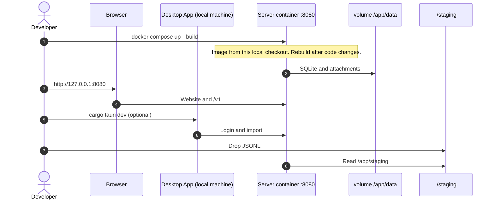

This page is for people who compile Message Crate. It explains how to build a Docker image from a local checkout, what that image contains, and how that build compares to the image CI pushes to Docker Hub.

Everyday coding should just run on the local developer machine. Those steps are on [Contributing → Build and run](/docs/developer/contributing/#build-and-run).

People who only want to run Message Crate, and who are not changing the code, should pull the published image. See [Start a Message Crate](/docs/user/features/owner/run-with-docker/#start-the-server).

Build a local image when the work is about the container itself. Examples:

- A change to `docker/Dockerfile`, `.dockerignore`, or the `demo-seed` crate
- Checking that the website still works when it is compiled into the image, with no Vite server
- Reproducing a Docker Hub build failure before pushing a `v*` tag

:::note
A merge to `main` does not publish an image. CI only builds and pushes `bitrealm/message-crate` when a git tag that starts with `v` is pushed. How versions and tags work is on [Release](/docs/developer/release/).
:::

## Two Compose files

Docker Compose reads a YAML file and starts a container from it. This repository has two of those files. They both listen on port **8080**. They do not do the same thing.

`docker/compose.yml` names an image that already exists: `bitrealm/message-crate:latest`. Compose downloads that image from Docker Hub. It does not compile this local checkout. That file is the sample for [Start a Message Crate](/docs/user/features/owner/run-with-docker/#start-the-server). Do not use that file from a local checkout if the goal is to test local code.

`docker/compose.release.yml` builds `docker/Dockerfile` from the files in this local checkout. The result is the same kind of image CI uploads to Docker Hub: a compiled server binary, the website copied into `static/`, and ffmpeg. After a code change, rebuild. The running container does not pick up edits on the local machine on its own.

A local checkout’s `.env.example` sets `COMPOSE_FILE=docker/compose.release.yml`. After copying that file to `.env`, `docker compose up --build` from the repository root uses the build-from-checkout file. Pass `-f` to override.

Do not run either Compose file at the same time as `./scripts/run-dev.sh`. That script also binds port 8080.

## What the image contains

The container is the server process only. The desktop app stays on the local machine and talks to the server over HTTP.

| Piece | Role |
|---|---|
| `message-crate-server` | HTTP API under `/v1/*` and the website on port **8080** |
| SQLite | Database and attachments under `/app/data` |
| ffmpeg | Converts media so the browser can play it |

The website in the image is the production Vite build from `web/`. There is no Vite dev server inside the container.

## How `docker/Dockerfile` builds

The file has three stages. Each stage is a temporary image. Only the last stage is what you run.

1. **Website.** Node 22 installs `web/` dependencies and runs `npm run build`. The output is `web/dist`.
2. **Server binary.** Rust 1.98.1, the version `rust-toolchain.toml` pins, compiles `message-crate-server` in release mode. The binary carries what it needs to generate Demo Data: the `demo-seed` crate, its two size settings, the Pride and Prejudice text, and the name lists.
3. **Runtime.** A slim Node 20 image gets ffmpeg, the server binary, `config/config.docker.toml`, and the website files copied to `static/`.

The build context is the **repository root**. `.dockerignore` decides what Docker sends into that context. It must ignore the live data directory at the repo root (`/data`) so a personal database is not copied into the image. It must not ignore `crates/server/demo-seed/data/`. That directory holds the Pride and Prejudice text and the name lists the server compiles in.

## Build from this local checkout

Work from the repository root. Docker Desktop or Docker Engine with Compose v2 is required.

### Before you start

Copy [`.env.example`](https://github.com/messagecrate/message-crate/blob/main/.env.example) to `.env` if Compose should read `UID`, `GID`, and `COMPOSE_FILE` from the repository root.

`UID` and `GID` are the numeric user and group on this machine. Setting them to `id -u` and `id -g` keeps files the container writes owned by the account that started Compose.

### Build and start

This is the usual local path. Compose compiles `docker/Dockerfile` and starts the container.

```bash title="Build and start from this local checkout"
docker compose -f docker/compose.release.yml up --build
```

The server is at **http://127.0.0.1:8080**. On a data volume with no database, the server adds the Demo Account with the medium data set (about 54,000 messages) before it listens, and leaves Message Crate unclaimed. The first screen offers **Create Owner** and **Explore Demo Account**; the Demo Account has no password. There is no switch for this: a Message Crate started by Docker begins the same as any other.

The container's entrypoint only writes the config and runs `serve`. Arguments after the image name run another server command in its place, with the stack stopped.

### Build without starting

Use this when the image should be compiled but not run yet.

```bash title="Build only, do not start"
docker compose -f docker/compose.release.yml build
```

### Match the CI build

CI builds `docker/Dockerfile` from the repository root. It does not use Compose. The shortest local equivalent is:

```bash title="Build with docker build"
docker build -f docker/Dockerfile -t bitrealm/message-crate:local .
```

CI uses Buildx and then pushes to Docker Hub. Locally, omit the push. To include the same optional build argument CI passes:

```bash title="Build with Buildx, load onto this machine"
docker buildx build \
  -f docker/Dockerfile \
  -t bitrealm/message-crate:local \
  --build-arg BUILD_METADATA= \
  --load \
  .
```

`--load` stores the image on this machine. CI uses push instead.

### Load the large data set

```bash title="Rebuild the Demo Account with about 613,000 messages"
docker compose -f docker/compose.release.yml down
docker compose -f docker/compose.release.yml run --rm server reset-demo --size large
docker compose -f docker/compose.release.yml up
```

### Start with no Demo Account

```bash title="Create the database empty, then start"
docker compose -f docker/compose.release.yml run --rm server create-database
docker compose -f docker/compose.release.yml up
```

This works on a new volume only. `create-database` leaves an existing database as it is.

### Rebuild without cache

Use this after a failed build that used an old `.dockerignore`. Docker may otherwise reuse a layer that omitted `demo-seed` data files.

```bash title="Rebuild without cache"
docker compose -f docker/compose.release.yml build --no-cache
```

### After the container is running

Browse and search work in the browser against the container. The desktop app is optional. Importing a phone backup still needs the desktop app on the local machine.



## What CI builds

On a `v*` tag, the **Docker image** job in `.github/workflows/ci.yml` runs after the Rust tests pass. It builds `docker/Dockerfile` with context `.` (the repository root) and pushes:

- `bitrealm/message-crate:<version>` — for example `0.10.0`, with no `v`
- `bitrealm/message-crate:<major>.<minor>` — for example `0.8`
- `bitrealm/message-crate:latest`
- `bitrealm/message-crate:sha-<commit>`

The same job can push an image without a release. Start the CI workflow by hand on any branch with **push_docker_image** ticked:

```bash
gh workflow run ci.yml --ref <branch> -f push_docker_image=true
```

The run goes through every CI job first, and then pushes `bitrealm/message-crate:sha-<commit>` alone. It does not move `latest` or a version tag, so the image people pull stays the released one. The server in that image reports its Build, the Product Version with the commit, for example `0.9.0+343fe0d8`.

That job is the Hub image. `docker/compose.release.yml` is the way to compile the same Dockerfile on a local machine. Pulling `bitrealm/message-crate:latest` is not a test of uncommitted Dockerfile changes.

## Run the published image

Pull and start `bitrealm/message-crate` from Docker Hub as described in [Start a Message Crate](/docs/user/features/owner/run-with-docker/#start-the-server). That page gives the `docker run` command; `docker/compose.yml` in the repository is the Compose form of it. Upgrades that keep the existing database volume are on [Update](/docs/user/features/owner/update/).

## Related

- [Contributing](/docs/developer/contributing/#build-and-run)
- [Release](/docs/developer/release/)
- [Start a Message Crate](/docs/user/features/owner/run-with-docker/)
- [Update](/docs/user/features/owner/update/)
- [HTTP API](/docs/developer/reference/api/)
- [Config and accounts](/docs/developer/reference/config-and-accounts/)
