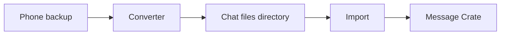
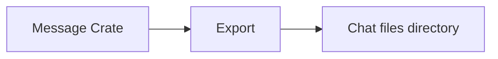

A phone backup is a copy of chats sitting on a computer. The server is a separate program with its own database. The backup does not become data in that database until a converter reads it and import loads the result.

[System Design](/docs/developer/design/) shows the directories in this project and how the website talks to the server. Which fields each converter fills in is on [Converter capabilities](/docs/developer/formats/). Every column in the chat files is on [Export structure](/docs/developer/reference/export-structure/).

## How chats get into Message Crate

1. A converter reads the backup. In the desktop app this runs as the first step of **Import**.
2. The converter writes a directory of chat files, plus photos and other attachments in an `attachments/` directory.
3. Import loads that directory into a server that is already running. In the desktop app this is the **Import** screen, which uses the `message-crate-push` library.



## How chats come back out

Export copies chats from a running server into a new directory of the same chat files. In the desktop app this is the **Export** screen, which uses the `message-crate-pull` library.



## Chat files

Each conversation is one text file whose name ends in `.jsonl`. JSON Lines means one JSON object per line.

1. The first line describes the conversation: who is in it, which backup it came from, and the current file layout (`schema_version` 6).
2. Each later line is one message: when it was sent, who sent it, the text, and any attachments.

Pictures and other media sit next to those files in `attachments/`.

```jsonl title="One conversation file"
{"schema_version":8,"export":{"source":"sms-backup-restore","tool":"SMS Backup & Restore","owner_identity":"+15555550100","owner_display_name":"Me"},"conversation":{"chat_identifier":"+15555550101","conversation_type":"individual","participants":[{"identity":"+15555550101","display_name":"Sam"}]}}
{"guid":"msg-1","timestamp_unix_ms":1400773261000,"direction":"outgoing","service":"sms","text":"Hello"}
```

The server only reads this current layout (schema version 8). A version-7 file is refused by name, never upgraded. The full field list is on [Export structure](/docs/developer/reference/export-structure/).

## Converters for full backups

Use these when a complete backup can still be made.

| Source | Crate | More detail |
|--------|---------|-------------|
| iMessage or an iPhone backup | `imessage-ir-exporter` | [Converter capabilities](/docs/developer/formats/) |
| SMS Backup & Restore | `sms-backup-restore-exporter` | [Input files](/docs/developer/formats/sms-backup-restore/input/) · [Field mapping](/docs/developer/formats/sms-backup-restore/mapping/) |
| WhatsApp | `whatsapp-exporter` | [Converter capabilities](/docs/developer/formats/) |

## Limited converters

Some files come from tools that were not built for this project, or that drop messages and attachments. These converters can still try. Prefer a full backup from Apple, SMS Backup & Restore, or WhatsApp when that is still possible. The User Guide calls these [rescue imports](/docs/user/import-sources/old-backups/).

| Source | Crate | More detail |
|--------|---------|-------------|
| GO SMS Pro | `go-sms-pro-exporter` | [Field mapping](/docs/developer/formats/go-sms-pro/mapping/) |
| iMazing | `imazing-exporter` | [Input files](/docs/developer/formats/imazing/input/) · [Design notes](/docs/developer/formats/imazing/design/) |
| OpenExtract | `openextract-exporter` | [Converter capabilities](/docs/developer/formats/) |
| SMS Backup+ | `sms-backup-plus-exporter` | [File layout](/docs/developer/formats/sms-backup-plus/format/) · [Field mapping](/docs/developer/formats/sms-backup-plus/mapping/) |

## Libraries that talk to a running server

These do not read a phone backup. They load or save the chat-file directory, or change a directory that is already in Message Crate's format. The desktop app links them directly; none is a command a person runs.

| Library | What it does |
|---------|----------------|
| `message-crate-push` | Loads a chat-file directory into a running server. Used by **Import**. |
| `message-crate-pull` | Writes a chat-file directory from a running server. Used by **Export**. |
| `message-reexport` | Turns an existing Message Crate export directory into another format, such as CSV or mail. Used by **Export** for any format other than JSON Lines. See [Convert an existing export](/docs/developer/formats/convert/). |
